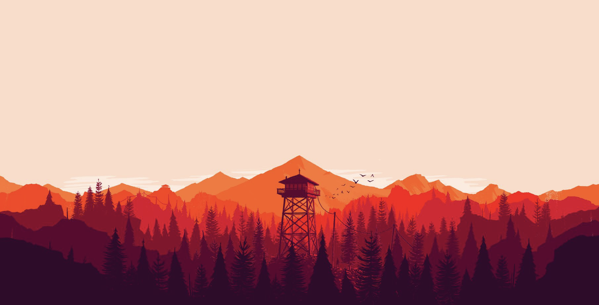
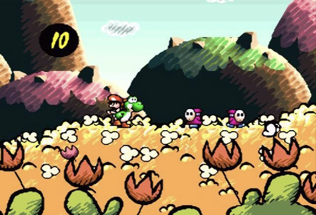
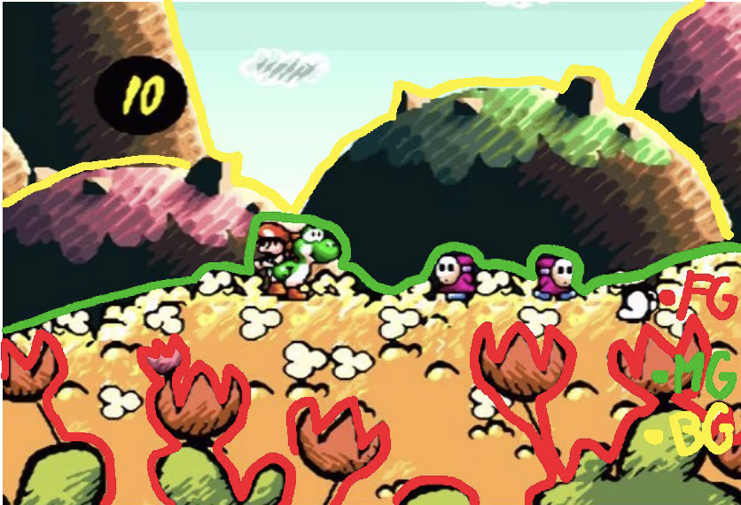
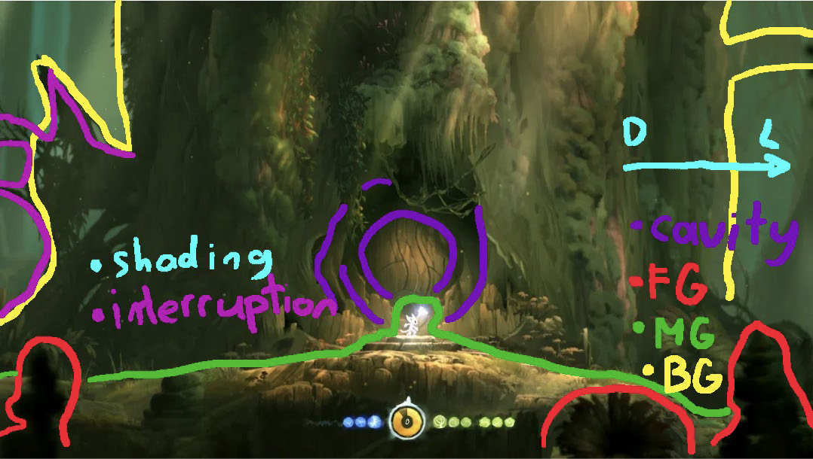
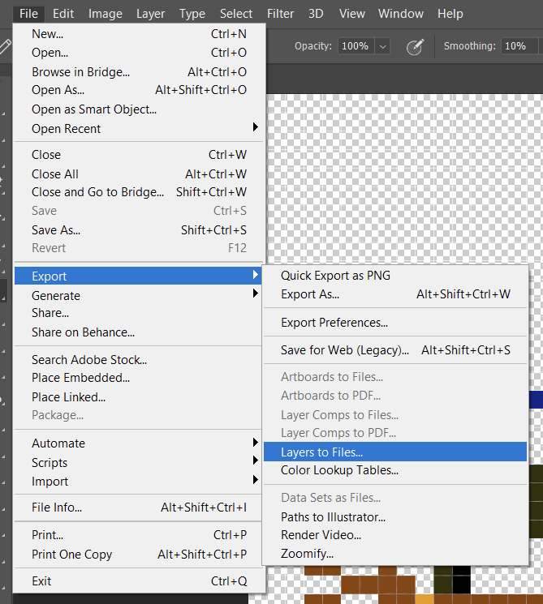
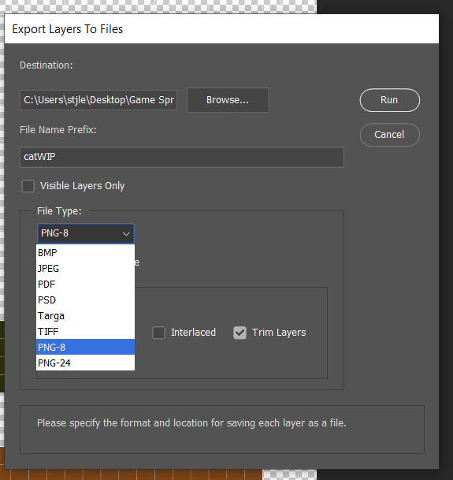

# Lab 12: Environment Design
{: .no_toc }

## Table of contents
{: .no_toc .text-delta }

1. TOC
{:toc}

## Overview
In this lab, you are designing an environment, or background, for a 2D infinite side scroller game. The purpose of this lab is to have practice in making art assets that establish an atmosphere for a game. Additionally, your piece should be layered to create an illusion
of depth (a.k.a the parallax effect).

## Parallax Effect
The parallax effect is created when the background moves slower than the foreground. This is accomplished through having multiple layers to a background and can look like this **(Fig. 1):**

In order to create depth and the parallax effect, there are different shades of orange/red with the darker colors in the foreground and the lighter colors in the background. This depth is what is trying to be achieved in this lab.

Please watch this video to understand the parallax effect completely: [https://www.youtube.com/watch?v=z9tBce8eFqE]

There are plenty of ways to achieve depth and a parallax effect. Below are some analyses of different game screenshots and how depth is created.

## Yoshi's Island

Depth is created through the foreground (the orange flowers and bushes), midground (the yellowish/orange field with white flowers), background 1 (dark hills with green/pink pasture on top), and background 2 (the light blue sky with clouds). In this screenshot **(Fig. 2)**, there is the use of scale and shades to create depth. 

The orange flowers in the foreground are the size of Yoshi and Baby Mario. The hills in background 1 are still big, yet the midground field is bigger in size and detail. Additionally, the hills are staggered to overlap with the lighter part on the right side in front of the darker part on the right creating more depth. Background 2 contrasts the dark hills with a light blue creating more depth using that contrast.

Here, the image above **(Fig. 3)** is highlighted to differentiate between the foreground (red), midground (green), and background (yellow).

## Ori and the Blind Forest

In this screenshot **(Fig. 4)**, there is the foreground (the dark flower and rock tower shapes that are out of focus) and the midground (the brighter grassy pathway where Ori is located and is more detailed and in focus). Directly behind Ori, there is a cavity that uses the layers of the tree with lighter browns closer to Ori and darker browns further from it. This is the opposite of **Figure 1**. Yet on the right side of the tree, there is the gradation from the lighter brownish green to the darker, shadowed teal green like the background hills in **Figure 1**. The use of different shades of color creates depth in this frame. Also, the interruption of the smooth transition between shades of color (indicated in **Figure 5**) creates a strong contrast and depth.

The image above **(Fig. 5)** is highlighted to differentiate the foreground (red), midground (green), and background (yellow). It also includes focus on the door, shading, and interruption of smooth transition.

## Pixel Art

**(Fig. 6)**

**(Fig. 7)** Figure 7 is highlighted to differentiate the foreground (red), midground (green), and background (yellow).

This piece exemplifies what is trying to be accomplished with this lab. There is the foreground with the arrow, the midground which contains the islands spread across the picture, and the background with large focal elements. Note how the background follows the general rule of being less detailed. We can also see strong contrasts between the colors in the piece, creating a sense of depth in the environment.

## How to Export for Unity

For Photoshop, go to `File > Export > Layers to Files…`. Then in the pop up menu, change File Type to PNG-8. Photoshop will export each layer as a separate file –– perfect for Unity!

## General Tips

- Objects of focus should contrast with what is behind it.
- Contrast, by color and/or outline, should be used in between layers of the environment to create depth.
- Each component of the environment (foreground, midground, background) has to be on different layers, otherwise you will not be able to export it (see below). 
- MORE IN FOCUS, MORE IN DETAIL. LESS IN FOCUS, LESS IN DETAIL. 

## Themes

The themes of the lab are as follows: **cyberpunk, fantasy, nature, or apocalyptic.**

Choose 1 (or more) and create a background that fulfills the checkoff list. You should be making an environment for a scrolling 2D platformer (something like the Pixel Art example).

## Checkoff

- Panoramic, extending left and right
- Have the background be able to be repeated, like in an infinite runner game
- At least 1 large focal element, like the watch tower in **Fig. 1** or the skull in **Fig. 6**
- At least 2 foreground elements, like the flowers in **Fig. 2** or **Fig. 4**
- Have a depth of at least three layers (background, midground, foreground) to create a parallax effect

## Bug Reports
If you experience any bugs or typos within the lab itself, please report it [here!]

[here!]: https://forms.gle/1C2GPHGDHCQo3WWe7 
[https://www.youtube.com/watch?v=z9tBce8eFqE]: https://www.youtube.com/watch?v=z9tBce8eFqE