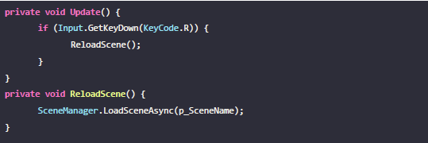
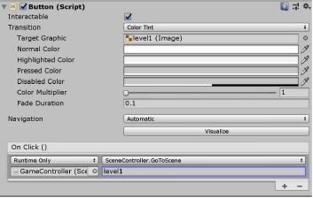
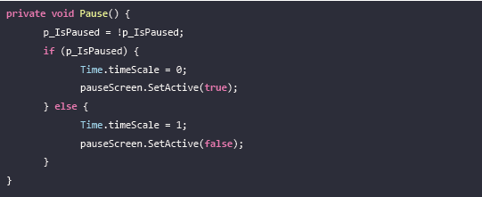
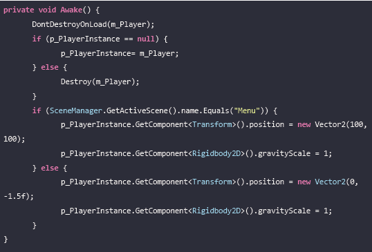
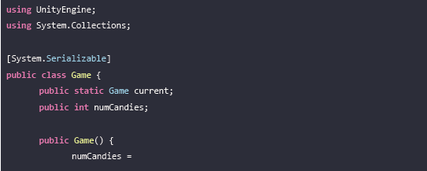
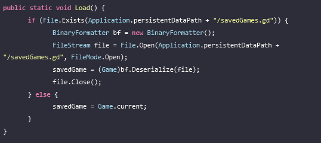
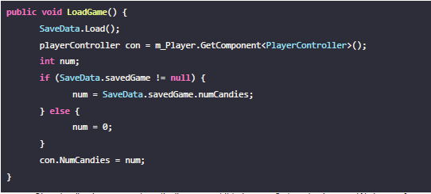
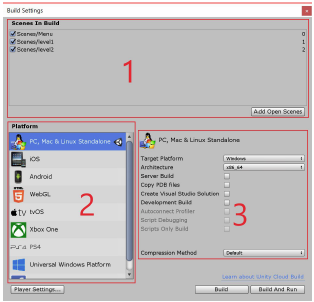

# Lab 13: Transitioning, Saving and Building
{: .no_toc }

## Table of contents
{: .no_toc .text-delta }

[Download Lab 13](https://github.com/berkeleyGamedev/TransitioningSavingAndBuildingLab){: .btn .btn-blue }

## Lab Overview
This lab will be going through how to transition between scenes and how to create save data in a game. Much of this lab will be topics that are final components in building a game, such as transitioning through scenes, creating and loading save data, and building an .exe file. In all, this will cover: 

1. Transitioning between different scene by pressing a button or key 
2. Resetting/reloading a level 
3. Setting up pausing in game 
4. Using DontDestroyOnLoad 
5. Saving and loading a game 
6. Building an executable 

This project file is set up with multiple scenes, some simple sprites and some scripts. The simple game is just an endless runner to collect candy, where the number of candies is saved between scenes, and can be saved between opening and closing the game. Most of the code that is currently provided in the project is just to make the game function and does not affect anything else in the lab. 

## Lab Instructions
Scene Transitions 
Scenes can be controlled in code using Unity.SceneManagement. In the Scenes folder, there should be 3 scenes (Menu, level1, and level2). In Menu, there are a few objects under the Canvas game object (Figure 1) in the Hierarchy. This is where all UI elements are. There is a UI lab for how to work with UI, but that is not necessary for this lab. 

Figure 1

The goal is to make scene transitions happen by pressing a button. To do this, we will edit the SceneController script. Some parts are already there, but we will be adding to it. To be able to use SceneManagement, ”using UnityEngine.SceneManagement” must be added so that the top looks like Figure 2. 

Figure 2

The first thing we will be doing is creating a way to reload the level by pressing ”r”. The simplest way to do this is to reload the current scene. One way to reload a scene is by using its name. 

1. Create a new string variable called p_SceneName (the p_ denotes this being a private variable. It is simply a convention and can be ignored) with the purpose of storing the name of the current scene. 
2. Then, in the Start method, retrieve the current scene’s name and store it in our p_SceneName variable. See Figure 3.

The first thing we will be doing is creating a way to reload the level by pressing ”r”. The simplest way to do this is to reload the current scene. One way to reload a scene is by using its name. 
Create a new string variable called p_SceneName (the p_ denotes this being a private variable. It is simply a convention and can be ignored) with the purpose of storing the name of the current scene. 
Then, in the Start method, retrieve the current scene’s name and store it in our p_SceneName variable. See Figure 3.

Figure 3

To reset the scene, a new function will be created that will be called in Update() whenever ”r” is pressed. In the new function, called ReloadScene(), we can just callSceneManager.LoadSceneAsync(p_SceneName) and it will reload our scene. LoadSceneAsync(name) loads the new scene separately from the scene currently loaded and will show the new scene as soon as it is finished loading. It will also automatically unload the current scene, so there is no need to unload a scene. The exception to this is if the mode of LoadSceneAsync is changed. By default, the mode is set to Single, so that only a single scene is loaded at once. However, if the mode is set to Additive, then the scenes will add on top of each other, so that scenes do have to be manually unloaded. Our game only needs to use Single mode. **Once this part of the code is finished, Update() and ReloadScene() should look like Figure 4:** 

Figure 4

Now, once ”r” is pressed, it will reload the scene, essentially resetting the level. Now we will make a function that takes a scene name as an argument and then moves us to that scene. We create a public function called GoToScene; it is public so that it can be called from outside of the script. Why call it from outside the script? Because we want to attach this function to a UI button. **GoToScene(name) should look like Figure 5:** 

Figure 5

These should be enough to start transitioning through different scenes. 
1. In the editor, attach the SceneController script onto GameController (this action must be repeated in all three scenes or else later portions of the lab won’t work). 

Figure 6

2. To set the buttons to go to each scene, we need to modify their corresponding onClick() commands. 

3. In the hierarchy, go to Canvas then select “level1”. When clicking on the button level1, there should be a Button component in the inspector that has a section for OnClick(). 

4. Pressing the plus will add a new command once the button is clicked (there can be multiple commands attached to one button). There will be a spot to put a game object and call a function from code. See Figure 6. This sets up your buttons.

The GameController game object (from the scene) will be put in here and the function that we want to call is the GoToScene() function from the SceneController script. Once GoToScene() has been selected, there should be a spot for the name of the scene.

5. Here, we want to write ”level1” because that is the name of the target scene once we press this button. 

6. After repeating this with level2, almost everything should be set up. We want all of the scenes that we are transitioning between to be accessible. To achieve this, we need to tell Unity which scenes are important. 

7. Go to File and find Build Settings.

Here is where all of the necessary scenes will be added.

8. Drag all of the scenes in the scenes folder into the red box in Figure 7. 

Figure 7

Unity now knows which scenes to “remember”. If a scene is not in there, it will not be accessible from a different scene (attempting to transition will cause an error). We will touch on the rest of Build Settings later, but **an important thing to note is that there is an order to the scenes. Each scene has an index number that it can be referenced from.** The scenes can be reordered in the Build Settings. Once all of the scenes have been added into the Build Settings, we can close it. 

If we start playing the game from the menu, we can now go to level 1 and level 2. However, we cannot access the menu from either level 1 or 2! To fix this

9. First open up level 1, open up its Canvas and set up the Menu button to go to the menu similar to how you set up the level buttons above.

10. Repeat this for level 2 and everything should be good to go. 

## CHECKOFF TIP: 
You should be able to go into any level and exit back to the menu.

At this point, each of the scenes should be accessible from every other scene. The next thing we’ll be doing is implementing a pause system. 

## Pause System

Our pause system will be quite simple. It is just going to be made up of a UI panel and the word ”Paused”. Inside the level1 and level2 scenes, under the Canvas, is something called the “Pause Screen”, this will be the panel we use when the game should be paused. 

We will also be using the SceneController script to implement this pause system. **Essentially, we will be setting it to active when ”p” is pressed and setting it to be not active when ”p” is pressed again.** In addition, when pause is active, we will **change the time scale to 0 so that nothing happens.** This method of pausing works when time is not important to the implementation of the game and helps to stop all physics and animations. 

**Another way of implementing pausing is to have a boolean in Update() that only runs the code in Update if the game is not paused.** This method gives more freedom, and more things can happen when the game is paused, but it also requires a lot more attention to detail to make sure that everything that needs to be paused is paused. See Figure 8 for an example.

Figure 8

For our code, we will be using the time scale. Inside of the SceneController script:

Create a new editor (public) variable for the pause scene so that we can activate and deactivate it as needed. 

Create a boolean to help us know whether or not we are currently paused (set it to false to ensure the game does not start paused). See Figure 9.

Format the code in a similar way in Update(). See Figure 10 for guidance.

Figure 9

Using the same format as the reload level code, we want the game to pause once ”p” is pressed. **This is the purpose of the formatting in instruction 15..** Note: we also don’t want this to work in the Menu scene, so we will take advantage of the fact that we have the active scene name and check that the active scene is not the Menu. See Figure 10.

Figure 10

In Pause(), change the p_IsPaused and change the time scale accordingly, where nothing happens when it is 0 and everything runs at normal speed at 1 (time scale is also a way to run a game at half or double speed). The time scale can be accessed by Time.timeScale. The resulting function should look like Figure 11: 

Figure 11

That’s all of the code that is necessary for the pause system that we want to implement. All that is left to do is:

Attach the Pause Screen object into the ScreenController script attached to the GameController game objects in Level1 and Level2 and then pressing ”p” should pause the game. See Figure 12.
CHECKOFF NOTE: Pausing will be checked. 

Figure 12

## Save Data

Now we are going to implement a way to save our data. One way to save is for it to be saved based on play session; as long as the application is not closed, the player’s data is retained. This is going to be done with Unity’s DontDestroyOnLoad function. The other save system we’ll be looking at demonstrates how to save data between opening, closing, and re-opening the game. The latter is a bit more complicated. 

### DontDestroyOnLoad

When new scenes are loaded (while in single scene mode), all of the game objects in the current scene are destroyed once the new scene is loaded in. However, sometimes we do not want certain objects to be destroyed because they contain important data that we want to persist between scenes (e.g. player health and inventory). DontDestroyOnLoad is useful for this purpose. Using it on an object tells Unity that object should not be destroyed when a scene is unloaded. An implication of keeping an object “alive” is that all of its children are also kept “alive”. 

For this game, we want to retain the Player object because that is where the number of candies is being tracked. If we do not do this, each time we switch scenes, the number of candies is reset back to 0. For this to work, a public game object called m_Player (the “m_” is another convention that can be ignored like with “p_”. In this case, it represents a variable that is visible in the editor) will be created to hold the Player game object. 

- The first thing that we want to happen when the SceneController script starts is for the DontDestroyOnLoad to run, so put it in Awake() as in Figure 13. 

Figure 13

DontDestroyOnLoad will be called on the player. Unfortunately, this might cause an issue - if there is already a player object in the scene, this will create a duplicate, persistent object. To get around this:
Figure 14

- Create a static game object to keep track of the “real” player instance. This p_PlayerInstance will determine whether or not an extra player is present. The code in Awake() should look like this (Figure 14):

The second part of the code, which you can just copy and paste, is there because the GameController object with the sceneController script does the same thing in each scene and thus will keep Player through all of the scenes that we have. However, we do not want to see the Player when the menu is active, only when the levels are in place. So this code is to place the Player in different positions depending on whether the menu or a level is loaded. This is not a great solution, but it is simple and works for this lab. 

- Back in the Unity Editor, if the Player game object is not already in the player variable in the SceneController script in GameController, add the Player in there now. 

- If you play the game and collect some candies in one level, exit and go to the other, the number of candies should stay the same. 

**CHECKOFF NOTE: You will need to show saving between levels.**

## Saving Games and Loading Saves

Now that we can retain data between scenes, let’s look at saving the game. This is going to involve creating a file outside of the game so that this file can be accessed later to read the data for each save. 

- The first thing that needs to be done is to create 2 new classes, one that will contain our serialized data (data to persist once the game is closed) and the other to write this data to outside files. 

- Call the serialized data class Game and the other SaveData. 

Any information that we want to save will be a variable in Game so that it can be set and retrieved. For us, all we need is the number of candies, which can be checked by calling Player.NumCandies. The Game class will be structured a little differently than our normal classes because we want to be able to call it from anywhere. Furthermore, it will not be a MonoBehavior script. We also want a variable to keep track of the most recent (or currently being played) game, so there will be a Game variable named current. Game.cs should look like Figure 15: 

Figure 15

The list of types that Unity can serialize can be found here: [https://docs.unity3d.com/Manual/script-Serialization.html#FieldSerliaized2]

The [System.Serializable] lets Unity know that it will be serialized. Any object inside Game needs to be serializable for it to be written to an outside file. 

- Now open up the SaveData script (the second class you should have created). This class will be used to write and read the files. This script will also not be a MonoBehavior script. The beginning will look like Game.cs (ie no “MonoBehavior” at the top of the script). There are a few packages that need to be used for serializing and formatting files. The new packages are System.IO and System.Runtime.Serialization.Formatters.Binary, but the default packages are still necessary. Make sure SaveData.cs contains Figure 16.

Figure 16

There are only 3 main things necessary in this script. 

- First, add a public variable for a Game object. See Figure 17.

- Second, add a way to write files, or save data. This is done by finding the current game, which is of the class Game and is the object current in that script, and using FileStream to write it to a new file. When the BinaryFormatter serializes the saved game, all of the data inside Game.current has been saved to an outside file that can be called when a game needs to be loaded. FileStream creates the outside save data file. See Figure 18.

- The third and final necessary component is a method to read files, or load data. This is basically the reverse of the last function. Now savedGame contains all of the data from the loaded file. We will also add a check to make sure some previous save data exists before trying to load something that does not exist. See Figure 19.

Figure 17

Figure 18

Figure 19

Great! Now the system is ready to use, all we need to do now is to call these functions at the right time. For this game, any saved game will automatically be loaded up into the game once it is opened and saving will be done manually by pressing a button. 

- First, since we want saving to be done by pressing a button, we want to create a public function, which we will do in SceneController.

- Create a new function SaveGame() in SceneController. Each time we save the game, we will create a new Game to set to Game.current so that it has the most updated number of candies. The code for SaveGame() in SceneController.cs should look like Figure 20:

Figure 20

Loading the game will have a similar function except this will also be reversed. This time, the saved data will be loaded first and then the candy number in Player will be changed by “Player.NumCandies = num”. LoadGame() will have a check to see whether SaveData.savedGame exists. If not then the player will start with 0 candies.

- Edit the code for LoadGame() in SceneController.cs to look like Figure 21: 

Figure 21

Since loading happens automatically, we want it to happen first, and only once. We have a few additional modifications to make before loading works as expected. Since we want it to happen first: 

- Place it in the Awake() of SceneController. Because Awake() is only called once per scene, we do not have to worry about loading multiple times in a scene. However, we do have to worry about it being called whenever we transition to a new scene. This can be remedied by having a static boolean to only have it work once. So this will only cause LoadGame() to be called once. SceneController.cs should now contain Figure 22. 

Figure 22

We will add two more things before going back to the editor: a way to reset the progress and a way to close the game. There should be a way to reset the progress, as in make the number of candies be 0. There is already a button in the Menu scene to do this, the function just needs to be written. This can be done by setting m_Player.NumCandies = 0 and then saving the game. 

- Add the code in Figure23 to SceneController.cs to accomplish the above. 
CHECKOFF TIP: The reset button should work :).

Figure 23

Next, there is going to be a button to quit the game (though this button will only work after you build the game). There is a concise line of code that can perform this: Application.Quit(). All we need is a public function that will call that function to close the game once it is opened. 

- In SceneController.cs, add Figure 24: 

Figure 24

- Now, back to the editor. 

- Add the SaveGame() function to the save buttons in level1 and level2 scenes.

- Add the ResetGame() function to the button in Menu.

- Add the QuitGame() function to the quit button in the Menu. 

All that is left now is to build the actual game. 

## Building the Game

The final step in making a game is to create an executable file. This can be easily accomplished by going back to Build Settings under File and making the proper selections. See Figure 25 for the following few paragraph references.

Figure 25

Number 2 is what platform this build is going to be made for (PC, mobile, web, etc.). By default, either the Windows or Mac module is downloaded. But, each of the different modules can be downloaded. 

Number 3 is for details of each platform. Here, there can be different options for Windows or Mac, since each OS has a different way of running these games. 

- Depending on what OS you are running, select that option in box 3 and click Build. It will create and save an executable file.

- When you open it up, you can experiment and see how the save system works between opening and closing the game, keeping the number of candies collected until you reset the progress. 

CHECKOFF TIP: You will need to be able to run the executable.

## Lab Summary

At this point you should be able to save progress between scenes as well as between runs of your executable file, as well as a way to use the UI to pause the game. There are many different things you can do with Scene Management across Scenes, and hopefully this lab was a decent introduction to them. If you are struggling at all, flag down a facilitator and don’t feel too discouraged. This was a very long and heavy lab and I am proud of you for getting through it. 

## Check off:

1. Run the lab from the executable file 

2. Go into a level, collect some candies and exit back to the menu 

3. Go into the other level and show that the number of candies is still the same 

4. Collect some more candies and save the game. Go back to the menu and quit the game using the Quit button 

5. Open the executable again and start any level to show that the number of candies has stayed the same 

6. Go back to the menu and click on Reset Progress, go back to any level and show that the candy counter has reset 

7. Finally, while in a level, press ”p” to pause the game 

## Extra Challenges 

- Create a new collectible and set up a system to store that in the game as well. Try to do something fun with it, such as having it move around 

- Make a new collectible that changes the player’s color and saves that color so that the next time a new level is opened or the executable is started, the player starts with that new color instead of the default white. (hint: you can get the player’s color by using GetComponent<SpriteRenderer>().color; it returns a Color object. This can then be changed into HSV or RGBA integers or a string) 

- If you are familiar with UI, create UI elements (text or images) that show that the game has been saved and that the progress has been reset.

- Edit MapGenerator.cs so that candies spawn when the player travels to the left (right now they only spawn to the right). 

## Extra Notes

- In each script that requires the Player game object, rather than manually setting the Player, GameObject.Find is used. Since we use DontDestroyOnLoad on the Player, manually setting the Player will usually yield the incorrect Player and therefore, that Player is destroyed and bugs ensue. 

- The mapGenerator script contains very simple code to create an endless runner, as well as using, instantiating and destroying prefabs 
- The candy script contains some simple interaction between UI elements and scripting 

- The cameraControl script has code that creates a smooth camera that follows the player around 

- There is another way to do save data and that is through PlayerPrefs, which can store simple data types. It can be called through Unity’s function for PlayerPrefs, which it has documentation on here https://docs.unity3d.com/ScriptReference/PlayerPrefs.html 

    - The opinion of a humble soul is that PlayerPrefs are simpler and easier to use (also better for most circumstances). While they were not taught in the lab, having gone through the lab should make using PlayerPrefs straightforward. 

## Bug Reports
If you experience any bugs or typos within the lab itself, please report it [here!]

[here!]: https://forms.gle/oiyM6iu3MinHfmNc7 
[https://docs.unity3d.com/Manual/script-Serialization.html#FieldSerliaized2.]: https://docs.unity3d.com/Manual/script-Serialization.html#FieldSerliaized2