# Lab 14: 3D Rigging
{: .no_toc }

## Table of contents
{: .no_toc .text-delta }

1. TOC
{:toc}

**Disclaimer:** The GitHub model this lab refers to is no longer available. Please use your own model.

## Introduction

Rigging is the method in which you create a set of joints such that your model will be able to deform and perform actions such as bending an elbow or knee. The first thing to learn about rigging is understanding the spaces you are working in and how to use them to your advantage. 

There are three spaces that we will utilize while rigging which will make your animating job a lot easier: world, parent, local. The world space is the space where you perform everything, think of it as the universe that embodies everything. The parent space describes the coordinates of an object relative to their hierarchical parent. For example, a room is in the parent space of a house which is in the parent space of the earth. You can interpret world space as the oldest/ultimate parent. Local space can also be thought of as the object’s space, thinking in relative terms of the object’s coordinates and pivot point. Understanding spaces is important because it is not only at the epicenter of how rigging works but, they enable us to set a neutral position or perfect a walking animation. Rigging correctly will make animating a long walk in the park as opposed to a trek through hell and back.

In rigging there are two main techniques as to how the skeleton will move/operate: forward kinematics (FK) and inverse kinematics(IK). 

In this lab you will be animating using FK. For this lab you will be working with a premade model that looks like the one below unless you want to use a previous model that you have made; however, understand you will have to interpret the instructions in respect to your model (the default model is in the github).


Forward kinematics is the default method of animating. In FK, when you rotate or translate a joint, its children joints maintain their offsets. In this tutorial we will be creating a rotation based rig for a more natural feel. First we will go about rigging out model using FK:

Before you start rigging it is good to understand that we will need a naming convention. A good naming convention saves both time and unnecessary headaches. For this lab we are going to use a similar naming convention to the one used at Blizzard Animations. The naming convention is *bone*_*number*_*side*_*type*. So for example if we are creating a spine it would be spine_00_M_jnt, spine_01_M_jnt, spine_02_M_jnt and so on. If you are creating something that can be mirrored we will change it so that the side corresponds like the left shoulder would be shoulder_00_L_jnt. Throughout this entire lab I will be using this naming convention but feel free to choose another one if you feel more comfortable using something else.

## Importing 

Now, go into the github and either clone or download the repository. In it, you will find our model. In Maya, go to File->Import and select the Base_Model. Now go into its transform and scale it down to 0.1 for X, Y, and Z. Finally, rotate it on the X by -90 so that it lays facing up.

## Deleting History 

Before we do anything else, make sure to delete the history of mesh. Select the Base_Model in your outliner then after it is highlighted, go to Edit->Delete By Type -> Non Deformer History. This prevents the model from breaking when you decide to start animating because as you can see Maya keeps track of all the inputs or actions that you have performed on your mesh and each of these can have undefined error on your model so it's safer to delete them.


## Making Joints

When rigging our model it is important to set a root joint or an ultimate parent joint. To start we will change our maya menu from Modeling to Rigging using this fall down menu.


What you will see is a change in the top taskbar options where it looks like this. For organization, go into your Outliner and with the Base_Model selected, create a Group (ctrl+g) called Skeleton. We will be putting all of the joints in here.


For this section of the lab we will mainly be using the joint tool located in Skeleton -> Create Joints. So we will create the first joint and name it root_00_M_jnt. By default, you can only place joints on the grid. Holding shift allows you to create another joint that is connected by a straight line. You can create joints by simply left clicking.

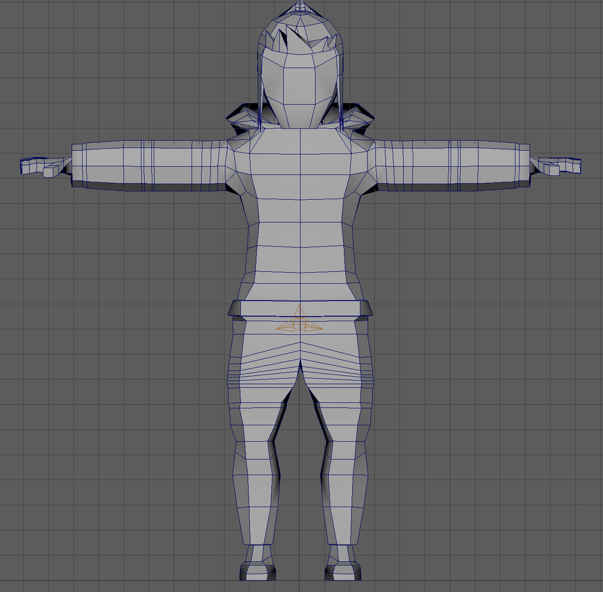

Our goal now is to set up one the the joints for one of the sides. Once done, we can take advantage of Maya’s mirror functionality to easily add matching joints on the other side.

One concept that will help in preventing any errors is making sure that all of our joint connections exist on a single axis. One issue it prevents is gimbal lock. We can make sure our joint connections exist on a single axis by only translating in one axis when moving the joint and then, using its parents rotation to move it into the desired position. So first, we want to zero out the translation values except for one and second, we want to zero out the rotation.

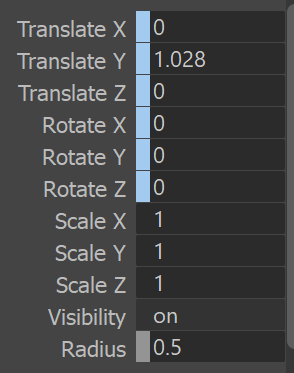

Remember feel free to make the joints as detailed as you want however, I recommend that you only create a maximum of five spinal joints, a single clavicle, and for the sake of time, only one joint for the hand (remember more joints means more stuff to work with later).

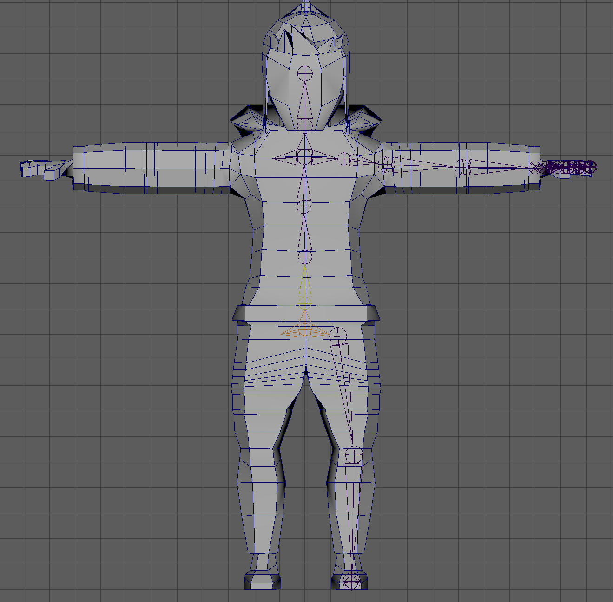

## Mirroring Joints

Once you have completed one side, let’s mirror it! Select the root of a joint that you want to mirror. For example, select the right shoulder or select the left glute. Go to Skeleton-> Mirror Joints and click the box for more options. From here we can actually automatically name everything for us

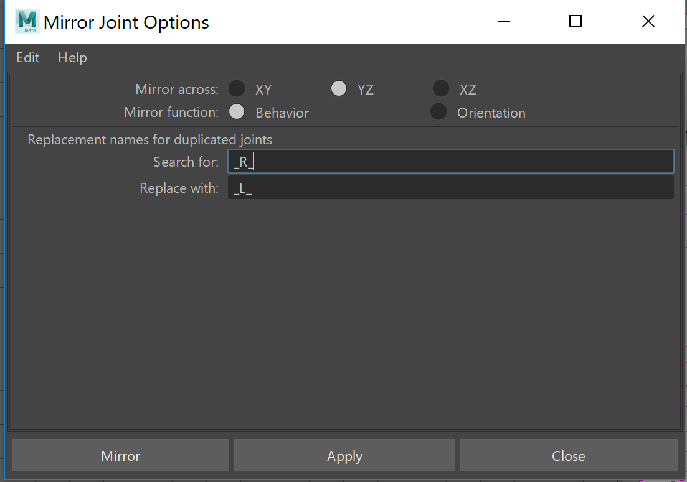

Just make sure that you have the correct options selected and fill in the “Search for” with “_L_” and “Replace with” with  “_R_” or vice versa depending on how you named it and which side you built. Press either Mirror or Apply, and now we have created a full skeleton similar to this.

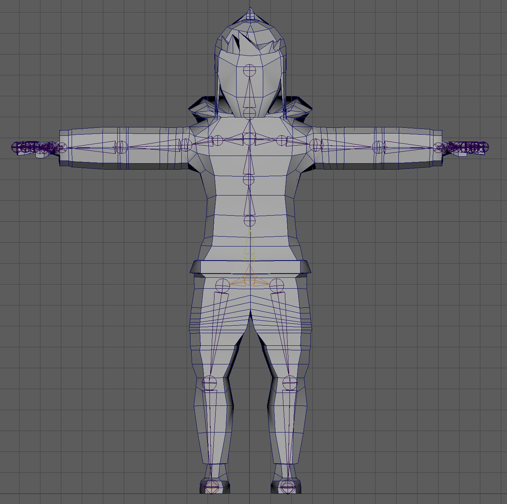

## Controls

After creating all of the joints, it is time to add controls or handles for us to be able to grab all of the respective joints. We will have a one to one ratio between joints and controls. For our controls we are using NURBS circles, you can try to create weird shapes but circles are just as functional. As for the naming conventions we will be changing it up slightly: for the spine it would be spine_00_M_ctrl instead of spine_00_M_jnt. We repeat this and rotate them accordingly to match the joints orientation. Start by creating a group named world_00_M_Zero, we will likely never be affecting this. Next we create a nurbs circle at the bottom and name it world_00_M_ctrl like so. To create a NURBS circle, hit Create->NURBS Primitives->Circle.

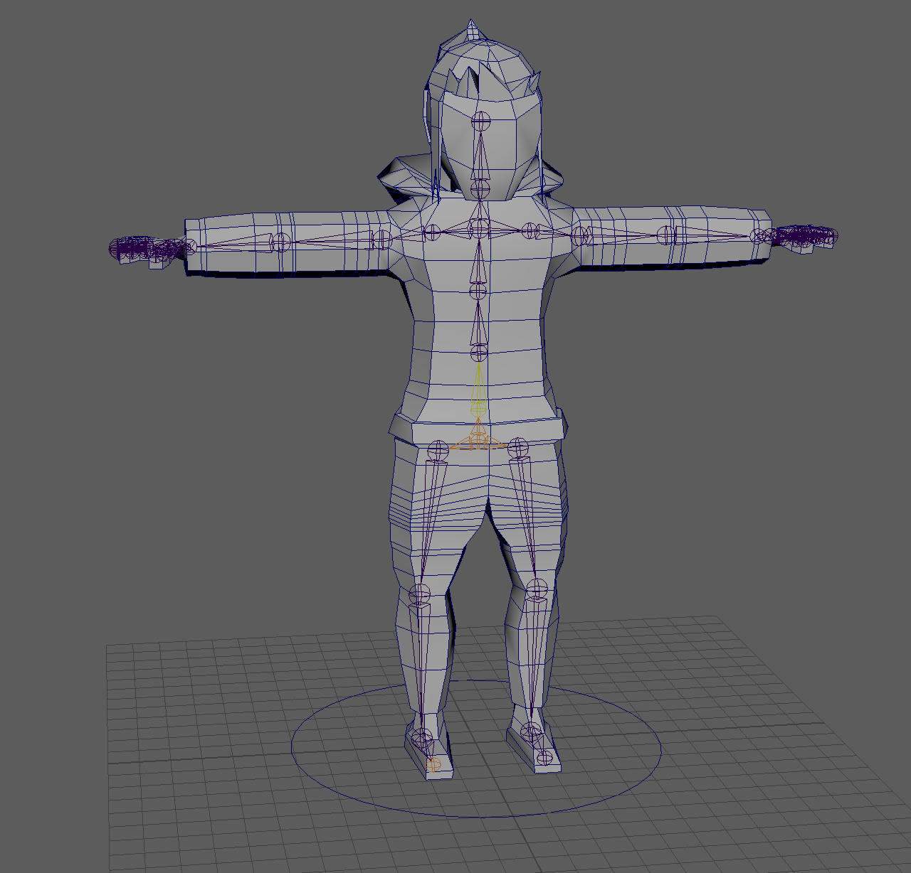

Once you finish that we will create one more group called root_00_M_zero that will encompass the root joint and add a nurbs circle called root_00_M_ctrl. It should now look similar to this.

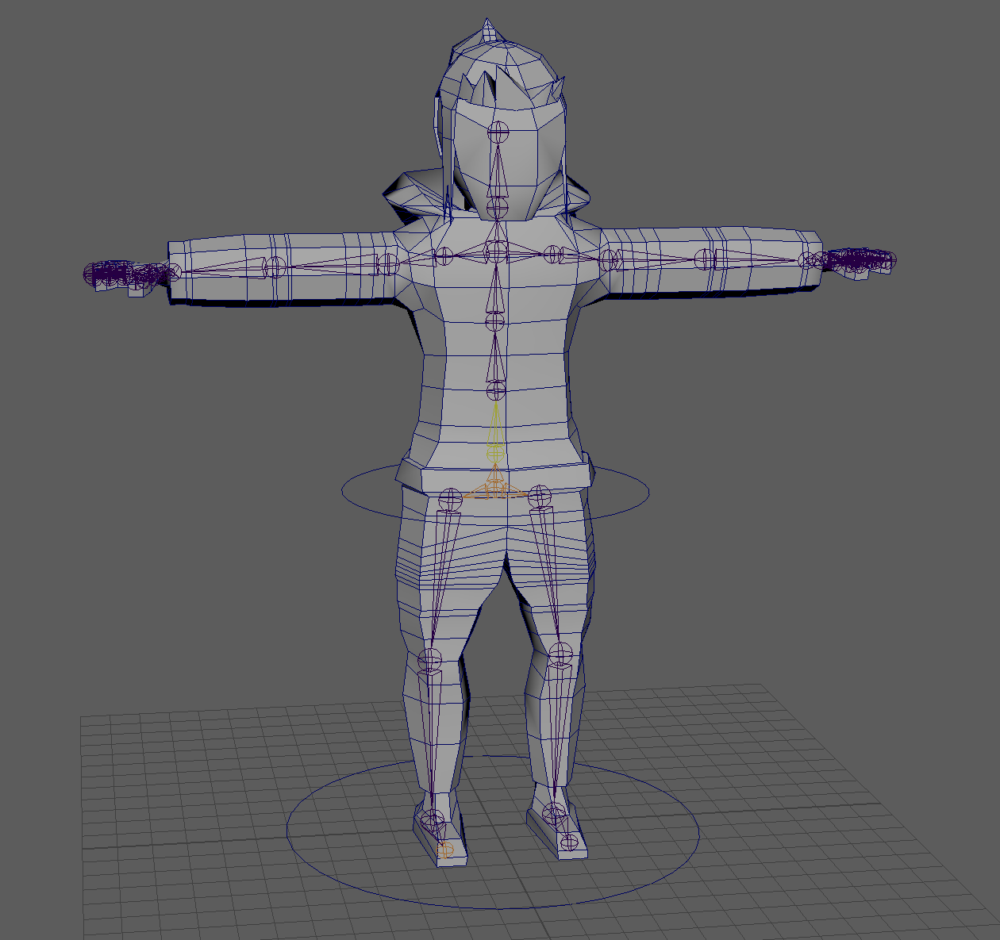

 We then begin by adding a ctrl for every joint and we end up with a similar product as this

 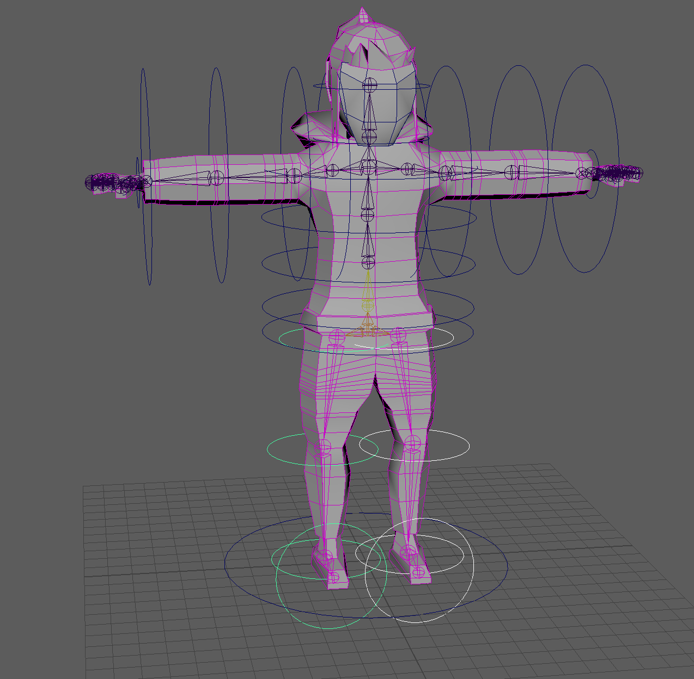

Your nurbs circles can be smaller, but should be at least bigger than the model itself. I only made them extra large for demonstration purposes.

## Parent Constraining Code

Finally all you have to do is constrain all of your controls with your joints so that the controls will move the joints accordingly. You can either manually parent constraint them or if you want, below is a script that will make your job a lot easier


```
sel = cmds.ls(sl =1)

for obj in sel:
cmds.parentConstraint(obj.replace("jnt","ctrl"), obj, mo=1)
```

Type the above script into the script editor (Windows->General Editors->Script Editor) and then drag it into the custom taskbar. To use this script you highlight all of the joints that you want to constrain then the control it is being constrained to then click the icon you made in the custom taskbar.

To manually constrain, select a joint and its corresponding control (you can do so by holding control). Go to Constrain->Parent. Rinse, Repeat.

## Skinning

Skinning is the heart of animation because skinning correctly can make animating easy while skinning incorrectly will make animating a living hell. To start skinning, highlight all of your mesh and all of your joints then go to Skin -> Bind Skin. Once you finish the initial skinning we begin the tedious part. Highlight our 3D model mesh and then go to Skin -> Paint Skin Weights and click the small Box for more options. As we highlight the various joints we will see that our bones are all skinned to random nearby locations on our model.

 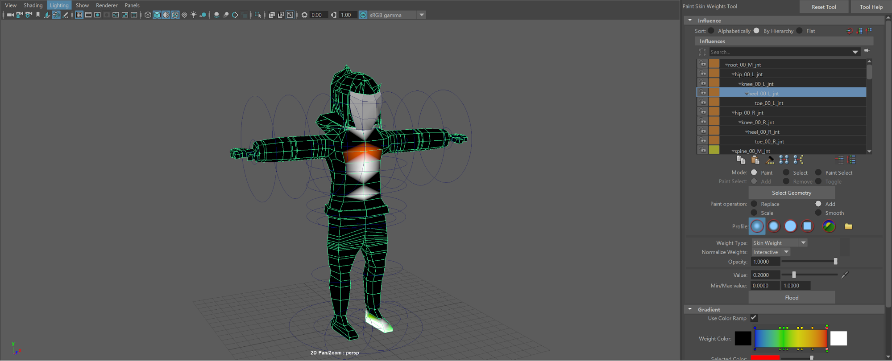

 Notice how my left heel is somehow skinned to my chest which is something you do not want (your results may or may not differ from mine). Before we get to fixing the influences lets begin to familiarize ourselves with the tool options.

 ## Paint Tools Options

In the influence section we have the sorting order of the joints at the top. I prefer sorting “By Hierarchy”. Next is mode, you will only really need to keep it on paint. The next option is paint select but that is not available unless you pick the respective option.

 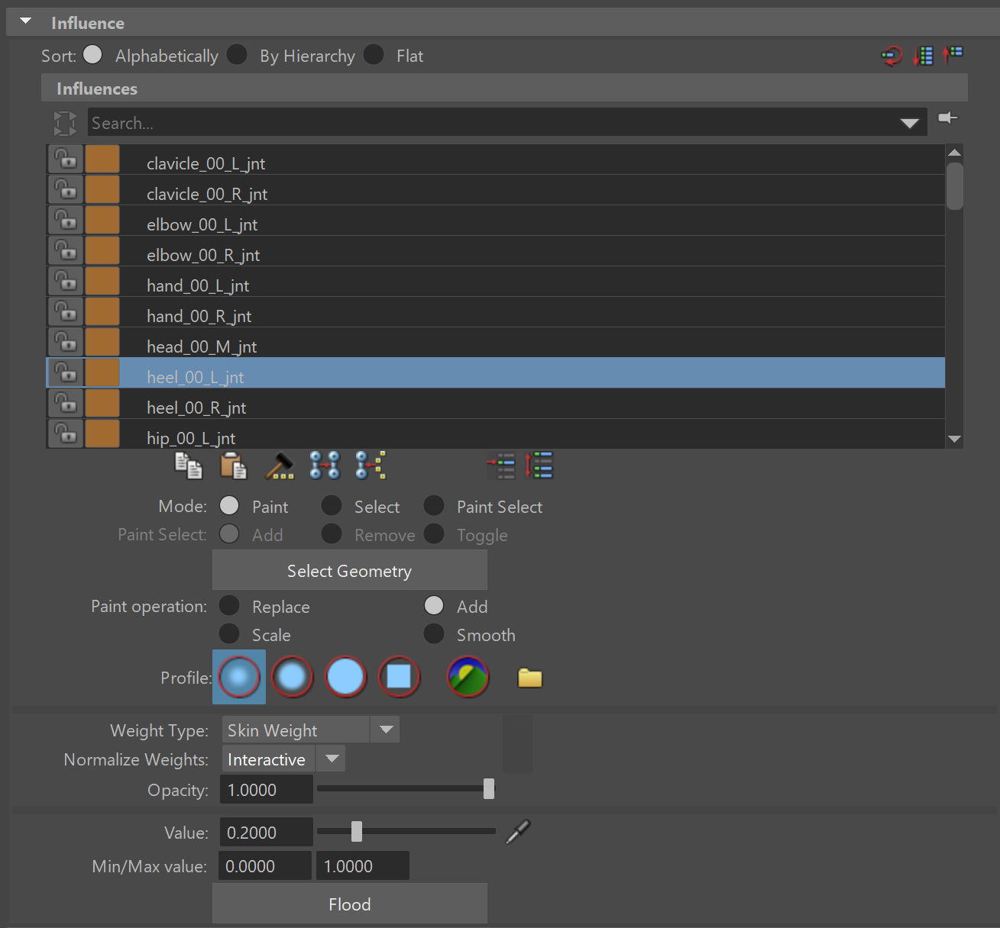

 We can technically access all the joints through the list however, if you have your joints visible then you can hold your right mouse button and choose “Select Influence”.

 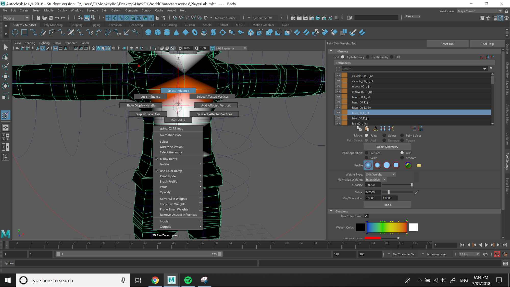

 Next is “Paint Operation” this is important as this will be how you will be changing the weights. The three main options we will use are Replace, Add, and Smooth. If you want to have the weight approach a specific value then use “Replace”. If you simply want to increase influence in a particular area then use “Add”. Finally the most important tool, “Smooth” is how you can affect more than just one joint at a time. Smooth will be used to ease the transition between joints and their influences. Do not worry smooth doesn’t randomly disperse the influence it just gives them to the immediately surrounding joints. I prefer to keep “Add” checked because “Smooth” can be accessed by holding shift while using the “Add” function.

We can skip the next 4 options and go straight to “Value” where I would recommend to keep at “.2” for precision. You should not modify the Min/Max value.

The only modification we will make under Gradient is checking “Use Color Ramp” because it allows us to see what the influences are. You only need to uncheck this option if you want to see the deformation better from a particular influence.


 

 Finally the last part that we need to worry about is Stroke However all you need to know in this section is Radius(U) where this controls the size of our brush. Now back to skinning.


## Fixing Influences

To fix awkward influences we have two methods. We can use the smooth option and continually keep smoothing the surrounding joint as it eliminates influences from other areas. Another option is to max the influence to the part of the model with the respective joint then smooth later. The second method worked better for me. When doing this, only worry about getting the joint to move the appropriate area. Do not worry about what it is moving elsewhere incorrectly because as you move up your model, you will overwrite it.

## Skinning Joints

Once you have done your initial skinning we want to focus on skinning the joints correctly so we don’t skew our model weirdly. To alter this, we will need to carefully move our joints to different positions and see how our influences affect those areas(remember you can always mirror your skin weights so do not worry about both sides). From here I recommend only using the “Smooth” option only and just going back and forth between the joints close to the desired area.

## Animating

Animating is not as terrible as you may think because thousands of people have worked on this program to make your life easy. You only need to save keyframes - key points of transition for a movement - so here we are going to practice making keyframes by creating a simple walking animation.

To start animating the walking animation, let's first check this option that looks like an arrow cycle with a colored plus in the middle. This allow Maya to auto save keyframes; however, I still manually save my frames just incase by highlighting our appropriate controls and pressing “S”


For the rest of the lab, you just need to animate these key frames

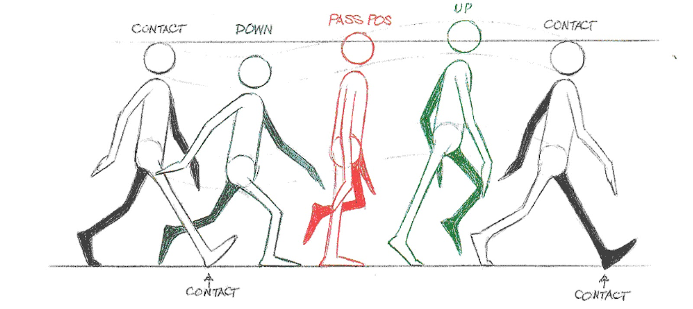

## Creating/Saving Keyframes

You create these key frames by clicking points along the timeline on the bottom and moving your joints then saving the respective joints. If you click on a different spot on the timeline before saving the current frame, it will not save your changes. Once ready to move to the next frame, highlight all of the joints that you modified and press “S”.

## Utilizing our Control Hierarchy

Because we set up a parent space and local space correctly, we have a cool advantage. When we create this walking animation we can translate the character as we move the legs and alter the foot position so that we can prevent the slipping motion you can see in some walking animations. Because we set up the parent spaces and a Master Control we can just turn zero all the translations on the master translation. When we are content with our set up walk cycles and there we have a clean walking static walking animation. Only zero out once you are content with your walk cycles I recommend doing 2-3 cycles cause it allows you to pick and choose specific frames. 

After zeroing out we just need to blend our animation so it smoothly loops itself. Highlight all of the controls and go to your timeline, hold shift and drag (by holding the left mouse button) over your initial frame (you know that you are dragging over frames when it turns red). Copy and paste it at the of your animation so that Maya will end your animation with the same keyframe as your starting one.

**TADA YOU ARE NOW AN ANIMATOR.**

Now you just need to export the model and animation to a Unity friendly format.

## Exporting

The exporting will be a little weird. Because our animation includes a constraint there is going to be an exporting error saying “Constraints Export Failed”, but do not worry this is technically because we decided to use a constraint. However, this is not found in other programs so in order to take care of this we simply “bake” the animation. Baking an animation is where Maya will automatically key some keyframes for the object that we constrained, in our case think of it like instead of manually setting the key frames, maya will set the keys itself.  One thing that is important to note is that you need to export the mesh itself then export the animations separately. 

## Exporting Mesh/Skeleton

To start this we want to highlight all the joints and all the mesh for your model. Then we want to start exporting by going to File->Export All and a menu will appear. Unity accepts FBX files which means you need to change the file type to an FBX export. Now open up File Type Specific Options->Include->Animation.

In this menu you want to ensure Animation is turned off because in the first import we simply want the mesh imported. Go ahead and export. To import the mesh into Unity just drag and drop the FBX file into unity. 

## Exporting Animations

Go ahead and open the export menu again. Turn animations and under the Bake Animation menu, check Bake Animation. Now export and once it finishes, drag and drop the animation into Unity. Voila! All you need to do now is set up the animator in Unity but as far as animating goes, you are done!

## Check Off

1. In Maya, show your walking animation.

2. Explain the difference between rigging, skinning, and animating.

## Bug Reports
If you experience any bugs or typos within the lab itself, please report it [here!]

[here!]: https://forms.gle/1C2GPHGDHCQo3WWe7 