# Lab 16: Lighting

{: .no_toc }

## Table of contents

{: .no_toc .text-delta }

1. TOC
   {:toc}

[Download Lab 16](https://github.com/berkeleyGamedev/IntroToLightingLab){: .btn .btn-blue }

## PREFACE
Although Unreal usually gets all of the love for really cool and photorealistic graphics, Unity is capable of just as much. The first step to achieving these graphics, aside from learning to 3D model (reference 3D modeling labs), is to understand how to light these scene properly to create realism, define the mood, and guide the attention of the player. **Note: this lab only covers lighting in 3D.**

## INTRODUCTION
In Unity, there are a number of elements that will affect lighting in a scene. Most notably, there are 2 different types of lighting: dynamic and baked lighting. **Dynamic lighting** can be performed simply by adding lights to the scene. This can be expensive though, since everything is rendered in real time, which is why baked lighting is necessary as a second type of lighting. **Baked lighting** is lighting that is calculated and saved as textures when building the game. When the game is run, the pre-rendered textures will be called to be put onto objects. This lab will only cover dynamic lighting.

The most straightforward element that affects lighting is the Light component, which can be attached to game objects. If you have not done so already, **open the Start scene in the lab files.** The scene contains the default objects that you will see when you create a new scene: a Main Camera and a Directional Light. The Directional Light has a Light component. I’ve numbered the important and most basic variables in the image below (Fig. 1).

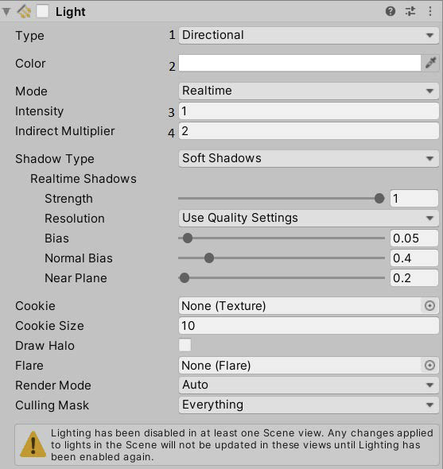 
(Fig. 1) Light settings in Unity

Our light is currently defined as a directional light (1). One of the biggest differences between lights will be what type the light is. There are a total of 4 types of lights: Spot, Directional, Point and Area (Fig. 2).

 
(Fig. 2) Different types of lighting

Since we aren’t covering baked lighting, we will only focus on the first three types.

Starting with what we already have in the scene, a **directional light** can be thought of as the sun. It will illuminate everything around it based on its rotation, like the sun rotating around earth and different parts having day and night at different times. (I know the sun doesn’t rotate around Earth, but I’m trying to make a point). The illumination of a directional light depends on its rotation but not its position.

A **spot light** is similar to a spot light in real life. It shines a focused light directly at an object. Both rotation and position affect where the light of a spot light will shine. Spot lights also have a few more variables that can be manipulated: range and angle. Range is how far the light will reach while angle is how wide the spot is.

A **point light** is like a light bulb, which, similar to a directional light, will illuminate objects around it. However, a point light is not quite as powerful as a directional light, just as a light bulb is significantly weaker than the sun. The point light will only light objects immediately around it - its position affects what is lit up but rotation does not matter. Think of it how you can take a lamp from one corner of the room to another to light different corners of the room, but (assuming you don’t have a lamp shade) rotating the lamp will not change what gets lit up. As opposed to the Sun which will burn your face off if you’re in the same room as it.

We’ll play with these one by one. The different light types do share some variables. To show these variables in action, let’s place some stuff in the scene. Place a 3D plane at (0, -1, 0). **Place a 3D capsule at (0, 0, 0) (create both of these as separate game objects). Double check that your directional light is at (0, 3, 0)** and camera is at (0, 1, -10), the default positions.

The first variable I’ll go over is **Color** (2). It is the color of the light emitted from the light.
To change the color, click inside the colored box and select from the color wheel, or
enter RGB/hex values for the color you want. You can see that the entire lighting in the scene has changed.

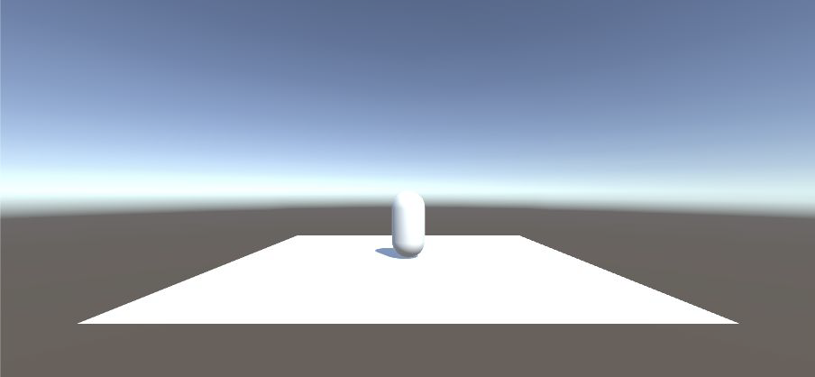 
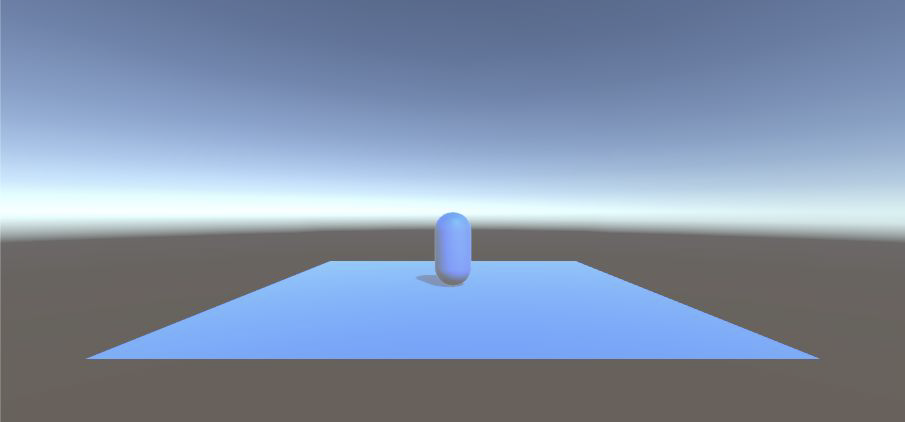 
(Fig. 3 & 4) Scene view of changing light color

The next variable down the list is mode, but since we are only using real time and not
baked, we won’t be touching this one at all. If you select it though, you can see that it
does have a “mixed” option. That will be a combination of both. If you are interested,
you can read the Unity manual for it here.

**Intensity** (3) is how bright the light will shine. 1 is the default intensity and 0 is no intensity. The higher the number, the brighter the light will be.

**Indirect multiplayer** is how much light bounces off objects. The higher the number, the more light will be reflected off of objects. This can also be affected by applying different materials on objects, but that will be covered a little later.

**Shadow type** (4) can be chosen from a choice of 3 different types of shadows: no shadows, soft shadows, and hard shadows.

 
(Fig. 5) Different types of shadows

Each of these 3 are exactly what they sound like. No shadows means that this light will not create any shadows. Hard shadows will have rough edged shadows and soft shadows will look more natural in that there are smooth transitions between shadows and light. Soft shadows are more expensive to generate and hard shadows are easier to render. It may be hard to see the difference between hard and soft shadows due to picture quality, but there is a difference.Try it for yourself!

No Shadow 
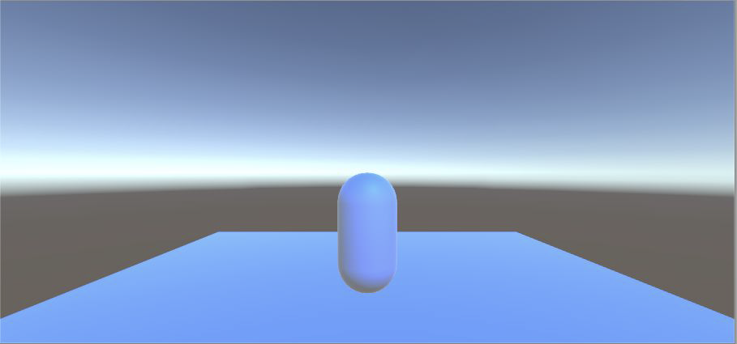 
Hard Shadow
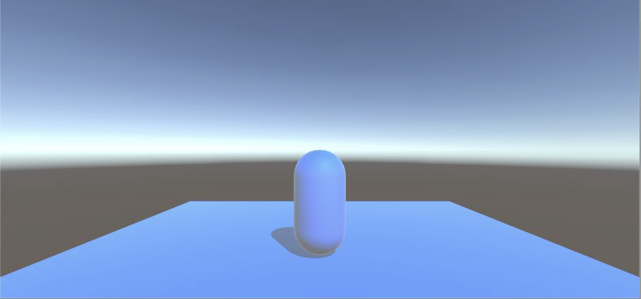
 Soft Shadow
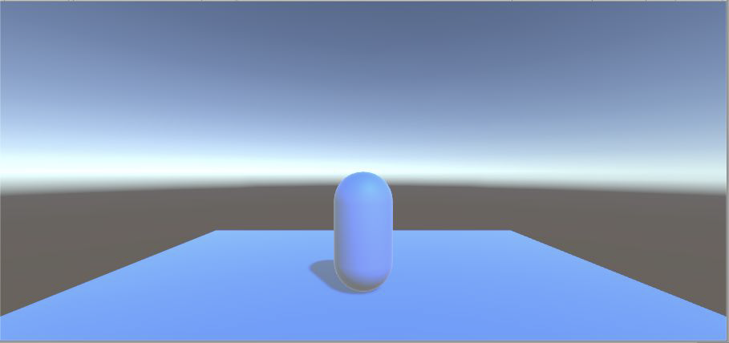
(Fig. 6)

I won’t be covering each aspect of the shadow, but I will mention **Bias**, which is where the shadow originates from. 0 is where you would expect the shadow to start forming and 2 is at the furthest area away from the origin. Having it at 0 may cause some artifacting, so the default value is 0.05. See Figure 7 on the next page for a visualization of different bias settings.

Bias: 0 
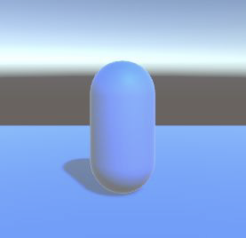 
Bias: 0.05 
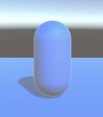 
Bias: 2
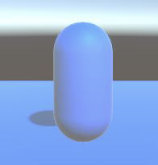 
(Fig. 7) 

That’s it for the basics! If you want an explanation for the rest of the Light component, read on. If not, you can skip to page 8.

**Cookie** is like a mask, or a gobo (for those who have worked with lighting irl). It will filter the light through a pattern or image so that the light that comes through will show that pattern. For spot light and directional lights, the cookie needs a 2D texture or image and for point lights, the cookie needs a cube map. You can think of it like holding a paper cutout in front of a flashlight (spot/directional) vs wrapping a pattern in a sphere around a light bulb (point).

**Draw Halo** creates a small area of light around the light itself, not where the light shines onto. In the image below, that pink glow behind the capsule is the halo on the light (light is repositioned so that the camera can see it). Halo can also be added as its own component to change the color and size of the halo. By default, the halo will have the same color as the light as the whole.

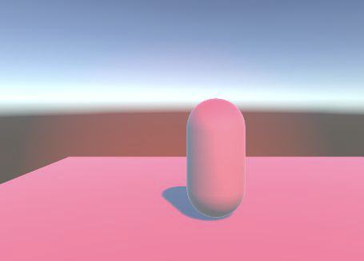 

(Fig. 8) Draw Halo visualization

**Flare** is essentially a lens flare, which only responds to the intensity of the light. For flare to be shown on camera, the Main Camera has to have a Flare Layer component (add through Add Component). Like Halo, this can also be added as its own component on the light.

**Render Mode** affects the priority of this light when rendering the scene. This is important when trying to optimize your game. It can be set to auto, important or not important. Important will render it with per-pixel quality, which is much more expensive than vector/object lighting. Not important will render using vector/object lighting.

**Culling Mask** is to select what layers will be affected by this particular light.

Now let’s put everything into use!

**Disable the directional light.** You’ll notice that the background looks a weird color now.

 
(Fig. 9) Skybox lighting

This is because there is a skybox, which provides some environmental lighting. If the word skybox looks familiar, take a look at the camera component. The first option on the component is clear flags, and the selected option is skybox. By default, we have a skybox that creates some natural lighting. We’ll be doing more with skyboxes and the camera options later; right now, we still need to create our first light.

**Create a point light** and set its position to (0, 0, 0).

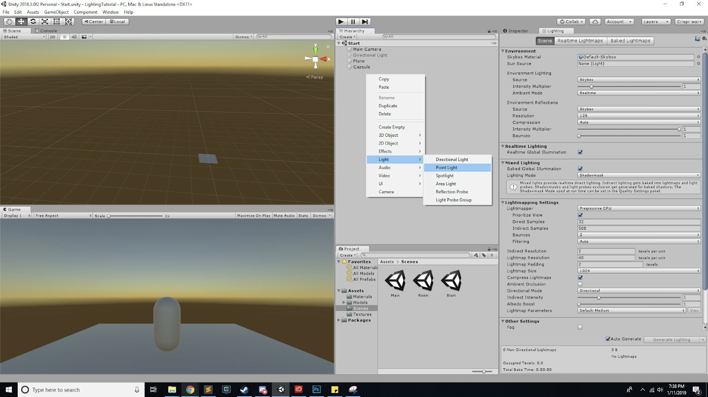 
(Fig. 10) Making point light

From the camera view, you should see the light illuminating the bottom of the capsule. Remember that point lights are like light bulbs. If you try to change its rotation, the lighting won’t change.

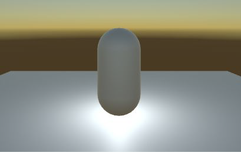 
(Fig. 11)

So, we can move the light around (via position in its transform) and you’ll notice how the capsule lights up differently. Test different values in the Light component to see what you can do with the point light.

There is a value that I didn’t cover, because directional lights don’t have them: range. **Range** is how far light will travel outward away from the light. This isn’t the same as intensity, although it may look similar when adjusting it.

When you feel comfortable with how to effectively use point lights, **disable the point light and create a spotlight.** Place the spotlight at (0, 10, -2.5). There should be pretty much no light on the capsule at the moment.

There’s another new value for spotlights: spot angle. **Spot Angle** is how wide the spotlight will cover. With everything I’ve talked about, **without manipulating the position of the spotlight, illuminate the capsule so that it looks like this:**

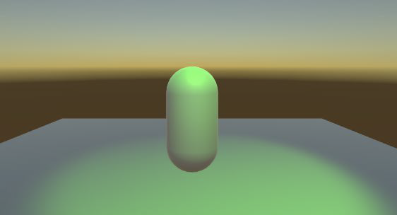 
(Fig. 12)

## MATERIALS
Great! Now I mentioned earlier that there are other things that affect lighting, materials is one of them. **Materials** are shaders that can be put onto models to create certain visual effects. This lab won’t comprehensively go through materials, but it will cover it a bit with regards to basic lighting. Unity has default materials to use, but we can create a new one to change how our capsule appears.

To create a new material, right click inside the Project window and under Create, there is an option for a Material. When the material is selected, there are a lot of things that can be changed in the inspector. If you are interested in doing more with materials, look at [Unity’s tutorial] for more info. We’ll just be covering the most basic things here.

To attach this material onto our capsule, look at Mesh Renderer. You can expand the Materials section. **Drag the material into the Element 0 slot.**

 
(Fig. 13)

So that we can see the extent of material changes, **change the spotlight color to white.**

Because we’ve already attached the material onto the capsule, any changes you make to the material will show up on the capsule. Also notice how the material in the Project file changes with the changes that you make to the material. For each of these values, I recommend changing them and seeing how the capsule changes and reacts differently to the light.

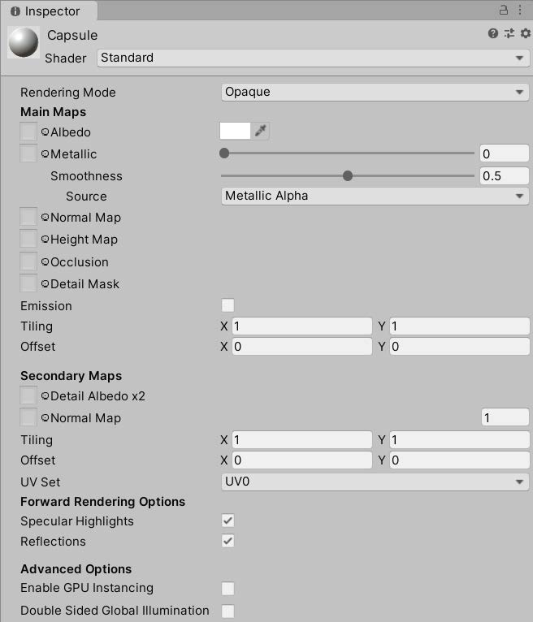 
(Fig. 14)

**Albedo** is the base color for the material. Any maps or textures you put on the material later will all have the albedo color included.

**Metallic** is how metallic it will look, from its shine to its smoothness. Metallic goes from 0 to 1, where 0 is not metallic and 1 is the most metallic. Smoothness also ranges from 0 to 1. 0 is a matte-like shade and 1 is very reflective.

**Normal map** is a type of bump map, which is used to give the material details to the surface of the object. The texture is layered onto the material for visual purposes. Textures provide the pattern or design of the material. These are typically 2D images. There is a folder of textures that you can try to put on. To attach one, drag it into the box next to normal map or use the circle to select a texture. (better explanation of normal and bump maps [here]).
(Note: all of the values that have a box next to them can take a 2D image or texture to set values)

 
(Fig. 15)

**Height map** determines the bumpiness and gives it extra definition for the material. It is very costly to do, but can provide a lot of detail to the material.

**Emission** is the light that the object itself emits. By default, there is no emission, and if the emission is black, there will be no visible light. However, by checking the checkbox, you can create emissions for the material so that it can produce a bit of its own light. It’s interesting to see color interactions between the light color, albedo color and the emission color, so play with that for a bit.

**Tiling and offset** move around the textures so that you can adjust it to what you think looks good.

Alright, that’s it for materials. Hopefully you got a good grasp of how materials are able to change how lights look. One final thing before we move onto the actual light settings.

**Disable the spotlight and re-enable the directional light.** Remember how directional lights are only affected by rotation and not position? We can see that first hand. Earlier, I compared directional lights to the sun. We can see that in action now.

Keep increasing the X-rotation. You will see the shadow of the capsule move, like the sun elongating shadows. You will also eventually see the light “setting” and “raising”, like the sun.

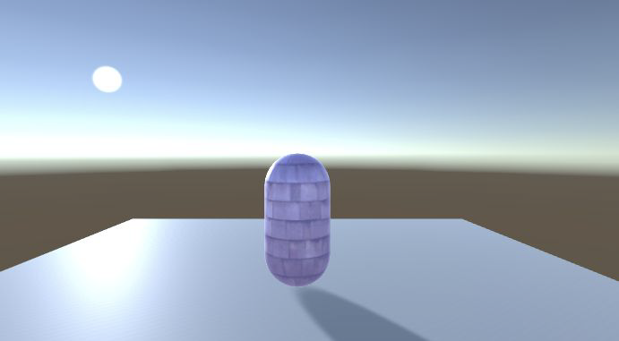 
(Fig. 16)

You can also see the final effects that the rotating directional light has on the capsule which, at this point, should have the material with some sort of light interactions.

## LIGHTING SETTINGS
Now we’ve gone over the basics of materials and the Light component. There are some other settings that can affect lighting as well. **Go to the scene named Room.** There, you should see a capsule in a room. If you look in the hierarchy, there’s no lights active anywhere. But you can still see the capsule in a seemingly enclosed space. This would be a result of the environment lighting.

At the toolbar at the top, go to Window > Rendering > Lighting Settings. It will open up a new window for lighting. We’ll only be working with the Scene portion of it. In fact, we’ll only be using the top Environment section.

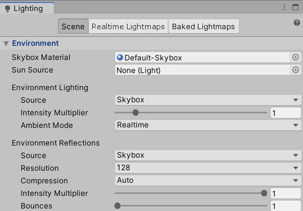 
(Fig. 17)

**Skybox material** is the material that defines the skybox. This means that we can give Unity our own skybox, but we won’t be doing this today. Likewise, sun source allows you to define a sun light that can be used elsewhere.

What we want to pay attention to the most to make it dark is the **environment lighting.**
Under **source** the skybox is listed. So naturally, if we remove the skybox, the
environment lighting should disappear right? Let’s try it. **Click on the circle next to
skybox material and select none.** Take a look at the scene.

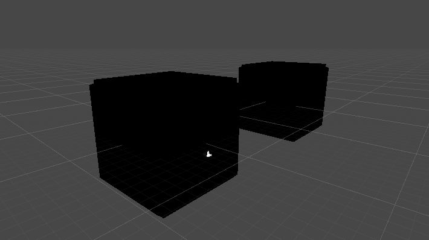 
(Fig. 18)

Great! So we’ve managed to turn off the lights in the box too. But this is only good if we don’t want the environment to have lighting either. So let’s try something else. **Reattach the “Default-Skybox” material onto Skybox Material.**

Instead, we want to change where the environment lighting comes from. Under source, **change the source to be color** (gradient will be similar, but I will only be covering color).

You can see now that inside the box, it is dark, but outside the box, you can still see the skybox. There is another alternative. Remember the Clear Flags variable on the camera? We can change that as well. Right now, if you pull the camera directly up (along the y axis to about (0, 7.5, -5.5)), you can still see that outside, there is a skybox and there is light around. There is a way that we can keep the skybox present in the scene without the camera seeing it.

Under the Clear Flags variable of the main camera, **select Solid Color.** Now, you can
see that the lights are still there but the camera sees everything in the background as
blue instead.

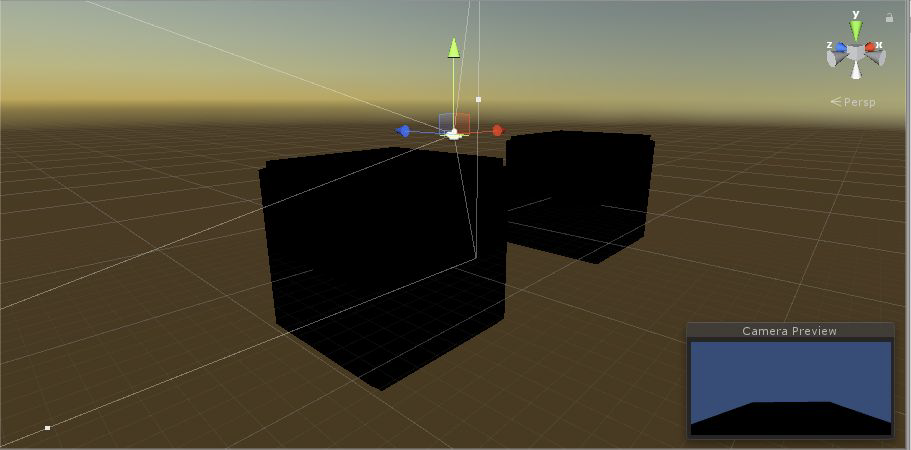 
(Fig. 19)

Awesome! now that our rooms are completely dark, we can mess around in those rooms a bit. Within each room, there is one of each kind of light. **In Room1, use lighting to recreate your best interpretation of an interrogation.** You can move anything around except the walls. To place the camera back into Room1, place the position as (0, -1, -5.5). You can move the camera around as well. Feel free to create new materials or add extra lights.

**In Room2, use lighting to recreate a festive holiday mood.** It could be modeled after any holiday, but some examples could be Christmas, New Year’s, or Halloween. Same rules apply for Room2 as Room1. To place the camera into Room1, set the position to (25, -1, -5.5)

## PUTTING IT ALL TOGETHER
Save everything that you’ve done in the Room scene. Go to the Main scene. **Properly light this environment.** The camera should show a normal looking (i.e. blue) skybox and the rocks and tree should have additional lighting. Create a fire effect within the rocks (you are not allowed to use particle effects). There should be no less than 3 lights in this scene.

This is a bare minimal introduction into lighting in Unity. If you are interested, there is a lot more to explore, including Lightmaps, baked lighting, and so much more. There are plenty of Unity tutorials and Unity manuals that can help expand on all that was covered in this lab.

## CHECKOFF
1. In the scene Rooms, show Room1 and Room2:
    - Room1 should look like an interrogation
    - Room2 should look like a holiday festivity
    - Explain what you did to achieve each room’s effects (materials, lights, etc.)
2. In the scene Main, show the environment and explain what you did to fix and improve the scene.

## CHALLENGE
Artists:
- Create textures for the environment in the Main scene.
Programmers:
- Create a day/night cycle in Main scene
- Create a script that changes the colors of the lights

Congrats! You finished the lab! :D

## Bug Reports

If you experience any bugs or typos within the lab itself, please report it [here!]

[here!]: https://forms.gle/1C2GPHGDHCQo3WWe7
[Unity's tutorial]: https://learn.unity.com/tutorial/rendering-and-shading
[here]: https://docs.unity3d.com/Manual/StandardShaderMaterialParameterNormalMap.html