# Lab 17: Delegates and Events

{: .no_toc }

## Table of contents

{: .no_toc .text-delta }

1. TOC
   {:toc}

**NOTE**: Download the lab, unzip it, and open the project folder in Unity Hub!

[Download Lab 17](https://github.com/berkeleyGamedev/DelegatesAndEventsLab){: .btn .btn-blue }

## Lab Overview
In this lab you’ll learn about delegates and events, which is a powerful tool in sending messages to several scripts without needing to have references to each script. Imagine that in your game, when the player dies, you want the score board updated, enemies and bullets deleted, and the UI showing up. One way to do this is to have a GameManager that, when the game ends, enable/disable everything --but this can get messy very quickly. With events, you only need to make a single call in the GameManager.

Delegates are special types just like ints, bools, strings, etc. However, delegates are custom types that you as the programmer create.
Events are variables declared using a declared type.

Delegates have a special signature:

 

Two potential delegates are:

 

And given these delegates, potential events are:

 

Now let’s assume we have three scripts: GameManager, PlayerGraphics, and EndGameUI (assume each class has more code that is not shown)

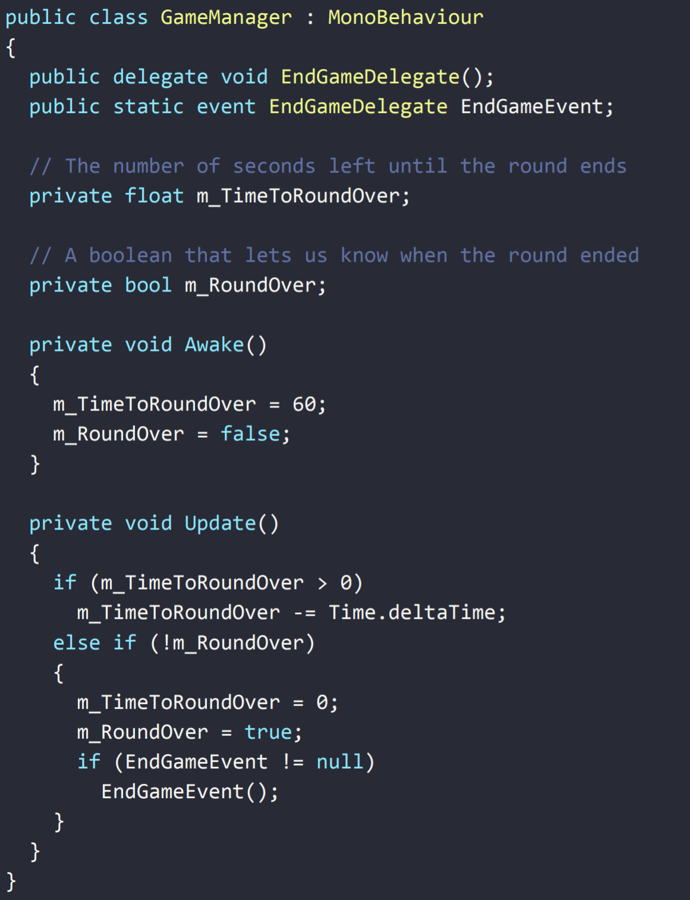 

Let’s take note of a few things:

- PlayerGraphics and EndGameUI both have two Unity functions implemented (OnEnable and OnDisable)
    - OnEnable is called when the GameObject is set to be active, whether it’s when the game starts or when gameObject.SetActive(true) is called
    - OneDisable, likewise, is called when the GameObject is disabled, whether it’s when the object is destroyed or when gameObject.SetActive(false) is called
- GameManager will broadcast the message, while PlayerGraphics and EndGameUI will be listening for the message

To add a listener:

To remove a listener:
 

If you ever add an event, you must remove it as well.

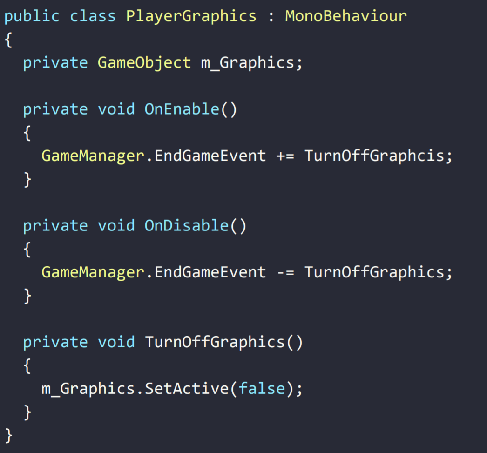 
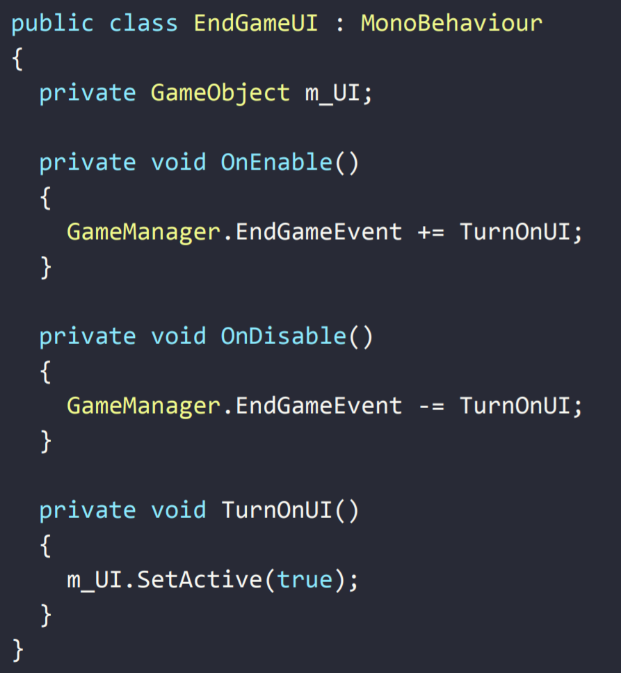 

Delegates have a particular signature. Any function that is added has to have the exact same signature. In our case, EndGameDelegate has a return type of void and zero parameters. Any function that will listen to it must also have a return type of void and zero parameters.

Notice how, before calling EndGameEvent in GameManager, we check to see if it is null. This is important because if you don’t check it and there happens to be no listeners, Unity will throw an error.

As you can see, this is very easy to extend and debug because everything is clean and separated. The GameManager has only one task, and that is to let everybody who is listening to know when the game ends. To do that, in GameManager, we call:

 

When this is called, PlayerGraphic’s TurnOffGraphics and EndGameUI’s TurnOnUI will both be called and their code will run.

## Lab Instructions
The goal of this game is to shoot down as many enemies as possible within the time limit. You move your character by holding down the left mouse button and dragging it around. The more ammunition you carry, the slower you move. You attack by pressing the spacebar, and you can only attack while stationary.

1. Let’s start by making the game playable when the “Play” button is pressed
    a. Open up Scripts/Countdowns/Countdown.cs
    b. There is a region called Delegates and Events; inside it, add the following lines:

     

    c. Now open up the region called OnDisable and Other Enders. Inside the OnDisable method, add the following lines:

     

    d. The countdown timer script will send out a message to the GameManager once the timer reaches zero. In this case, although we know ahead of time that the GameManager will listen in to the timer, it doesn’t make sense for the timer to store a reference to GameManager.
    
2. Let’s go ahead and choose a function in the GameManager script to listen for this event

    a. Open up Scripts/GameManager.cs
    b. In the OnEnable, Setups, and Resetters region, tell our GameManager’s StartGame function to listen to Countdown’s StartGameEvent method

     

    c. Remember to tell the function to stop listening to the event in the OnDisable method as well.

3. Finally, let’s implement a score counter so that when enemies are killed, it adds points

    a. Open Scripts/Player/Bullet.cs
    b. Add this to the Delegates and Events region:

     

    c. Next, look at the Collision Methods region and inside the OnParticleCollision method, add:

     

4. All that’s left is to make GameManager’s AddPoint function listen. We need to add two lines; one in OnEnable and one in OnDisable.

## Lab Summary
Now that you’ve learned about delegates and events, you can use them to send messages to several different scripts without having to clutter up your code with unnecessary references. They’re easy to extend and debug, and will be useful as your game gets bigger, and there are more scripts and information to keep track of.

## Checkoff
1. Play one game and get a few kills before crashing into an enemy
2. Play a second game and get a better score, and stay alive all the way
3. Show that the scoreboard changes appropriately

## Challenges (Optional)
1. Make it so that whenever an enemy is killed, two are spawned
2. Add a powerup that, when picked up, increases the movement speed of all enemies by some scalar
    a. When picked up, the powerup sends a message to all enemies that are alive
    b. The message also passes a float
    c. The velocity of each enemy is scaled by the float
    d. After a certain amount of time, the velocity of the enemies returns to normal

## Bonus - recommended reading, but not required
Here’s a slightly more complex example. This time, we’ll use the following scripts: AllDelegates, PointOrb, ScoreManager, ScoreText, ScoreEffects, GameManager, and WinnerText (like before, assume that each class has more code that is not shown)

The goal of the game is to gather 21 point orbs before any of your opponents.

Here, we created a script that can hold all of our general delegates in one spot. This allows us to use the same delegate signature for multiple events without having to recreate the delegate each time.

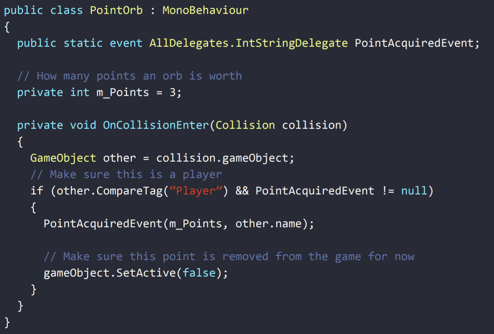

Here, we made a small check each time something collides with the orb. If the GameObject that collided with the orb is a player, we send a message saying which player collided and how many points they should receive.

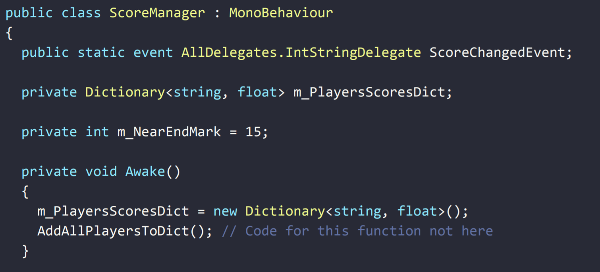

Each time a player scores a point, the ScoreManager runs its increase score method to increase the score of the appropriate player. If a player starts nearing the end mark, the ScoreManager will start sending messages that the score has changed (it only sends a message after receiving a message that a player acquired more points). The idea here is that players know who is winning and by how much as the game reaches the end.

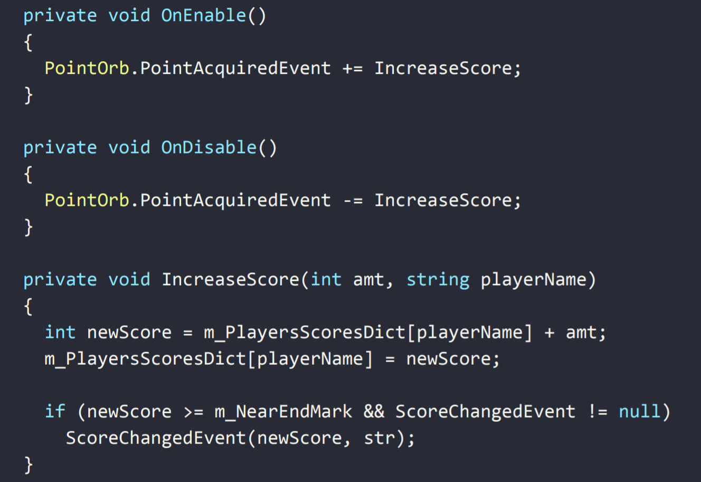

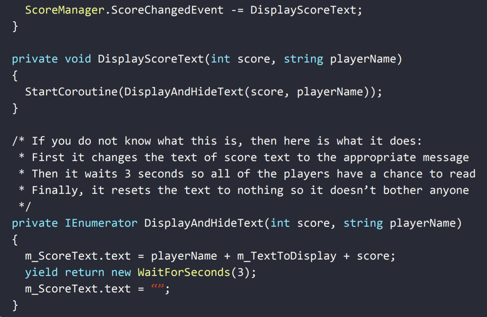

This method simply sets a UI text component so that everyone can read and know immediately who’s ahead and how many points they have. It listens to the ScoreManager’s event and only updates the UI when it receives the message that the score has changed.

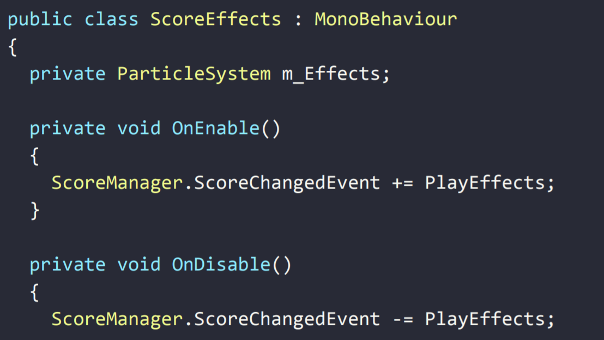

Similar to the previous script, when the score changes, a particle system plays right in front of the player to notify them that someone is getting closer to winning.

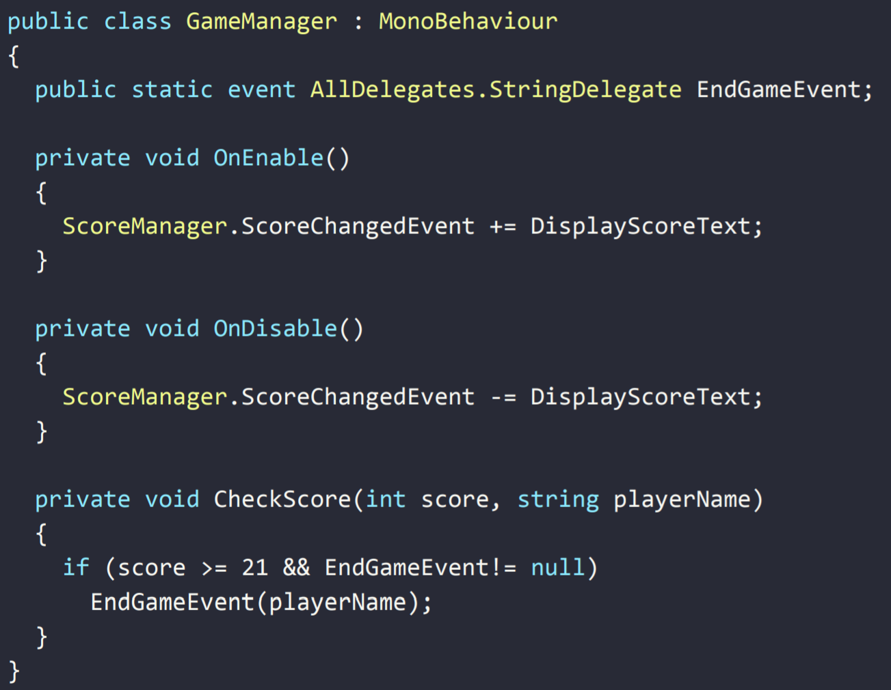

When a player’s score reaches 21, the GameManager sends out a message that the game is over. There are a lot of scripts listening to this message in preparation to end the game.

WinnerText is one of the many scripts listening to see when the game ends. This script will print out who won the game once the game ends.

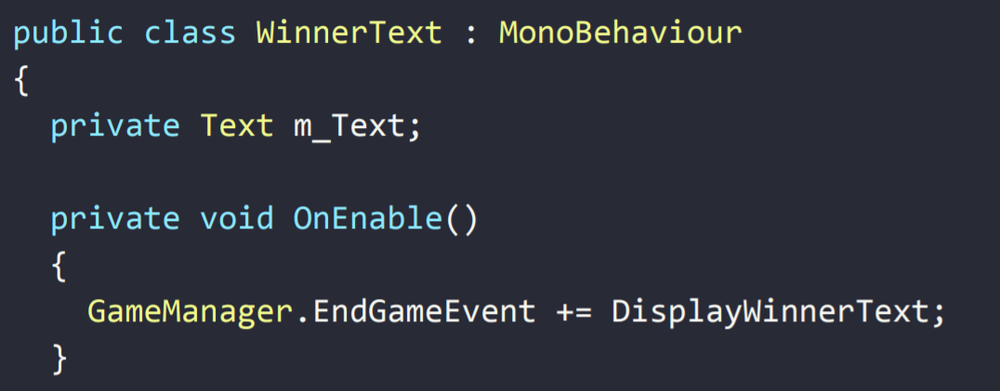

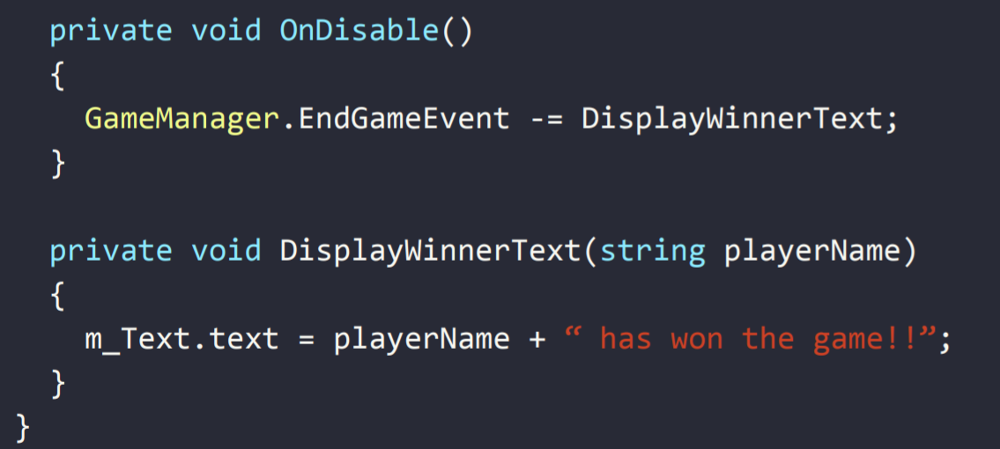 

## Bug Reports

If you experience any bugs or typos within the lab itself, please report it [here!]

[here!]: https://forms.gle/oiyM6iu3MinHfmNc7
