# Lab 9: UI and Layering
{: .no_toc }

## Table of contents
{: .no_toc .text-delta }

1. TOC
{:toc}

**NOTE**: Download the lab, unzip it, and open the project folder in Unity Hub!

[Download Lab 9](https://github.com/berkeleyGamedev/UILab/archive/refs/heads/master.zip){: .btn .btn-blue }

## Lab Overview
In this lab, you will be making a shop to learn how UI elements work in Unity. UI is present in most games, yet can get quite complicated when you have to consider how the UI layout will look on different screen resolutions.

This lab will cover both how to set up UI elements and anchor them correctly and get them to interact with each other. It will also cover how to use scripts to specify the functionality of your UI elements.

## Lab Instructions
First, navigate to the shop scene. In the hierarchy on the left, right click and create a new canvas UI element. The canvas deals with all the UI, so every UI element must be a child of a canvas. When you make a canvas, an EventSystem will also be created. The EventSystem is responsible for processing and handling events in a scene. Every scene will have one EventSystem. We’re not going to go into the EventSystem in this lab, but feel free to look more into it on your own time.

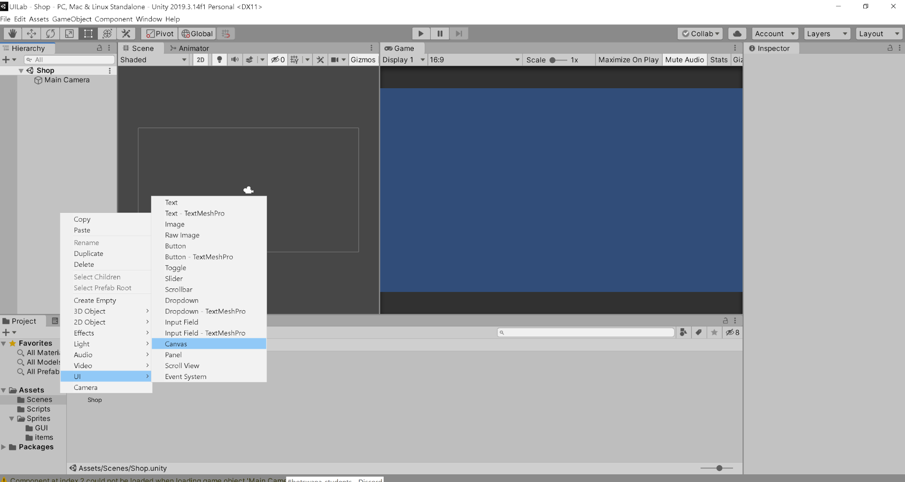  

Now let’s make our first visible UI element. Select the canvas in the hierarchy and create a Panel. This will be the background of the shop.

  

Now, select the Panel in the hierarchy and go to the inspector, and check out the Image component. This is the background for our panel. Go to the Sprites>GUI folder and drag the sprite titled *big panel 1* into the Source Image part of the Panel object. If your Panel looks semi transparent, double click on the color field in the Image component and drag the Alpha (A) variable all the way up to max.

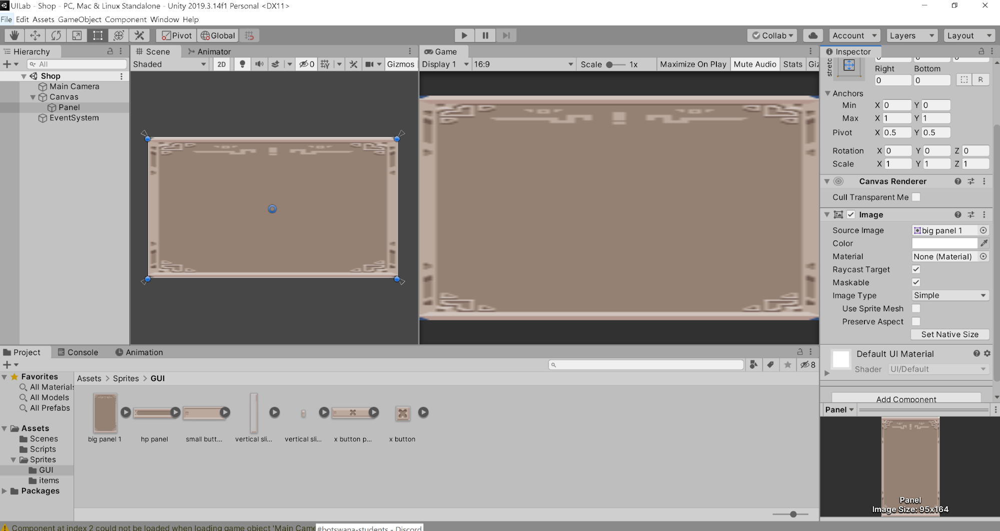  

Now that we have something, let’s resize the panel so that it looks better. When you click on the panel in the scene, you should see 4 blue dots, 4 white arrows, and a blue circle in the middle. The blue circle is what marks the center of the panel and the axis of rotation. The 4 blue dots mark the panel boundaries. If you move and drag them around, you’ll be able to scale the image. Lastly, the white triangles are the anchors, which help determine the position of the UI element. It is anchored onto its parent element, which is either the Canvas or another UI element (anything with a RectTransform component). The anchor can be moved through the options in the RectTransform component.

Let’s make our shop background look a bit better by shortening the width of the object. First let’s make sure that our images scale with the screen size, so that even if the screen size changes, the relative size of our UI elements will stay the same. Go to the Canvas and change the Canvas Scaler UI scale mode from Constant Pixel Size to Scale with Screen Size.

  

Now change the width and height of the panel to your liking by dragging the corners.

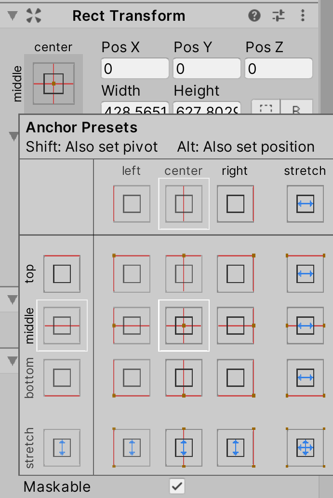

Once you find a proportion you like, look at the RectTransform component. If you click on the box on the left, you’ll be able to change the anchor presets.
Simply clicking on any of the options will set the anchors (the white triangles) to that position. This will affect the way the UI elements change as the screen changes in resolution or size. For example, if you set the anchors to the top left, if you drag the size of the Game display larger and smaller or change the resolution, the UI element will stay at the top left of the screen.
If you hold down Shift and click one of the squares, you’ll also set the pivot of your element, which is the axis of rotation and marks the “center” of your element. For example, if you set the pivot to the top left and increase the width or height of your element, your element will change in size from the pivot.
Lastly, if you hold down Alt and click on a square, you’ll set the position of your element. This is pretty straightforward.
The options on the right and bottom allow you to expand your element to stretch the entire width or height of its parent. Remember that all of these options will change your element’s anchors, pivot, and position *in relation* to its parent!

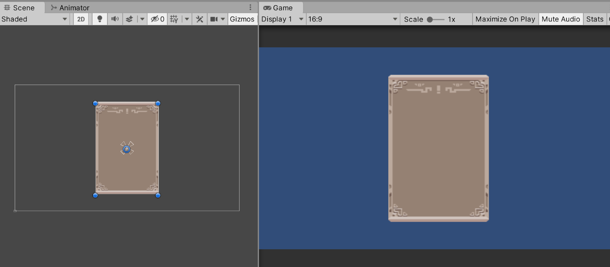

With that being said, let’s anchor our UI to the center of the screen. Hold down Alt and click on the middle square so that we set the position and anchor of the Panel to the center.  
    
Now, let’s add the title and exit button. Create a new Image and Button as children of the Panel.

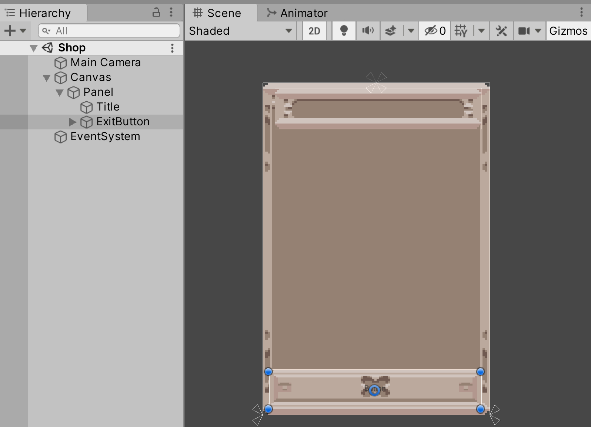  

Go into the GUI folder and put the *hp panel* sprite on the Image, and the *x button passive* on the Button’s image component. Let’s also name the objects so they’re a bit more organized. Lastly, use the RectTransform of each object to anchor the Image to the top center of the panel, and the Button to the bottom center of the panel. Drag the corners around until you’re satisfied with the size of your elements.

Now, expand the Button and delete its child Text object. Then right click on the title Image object and add a new UI component called Text - TextMeshPro.

TextMeshPro is a replacement for Unity’s default text option. To put it briefly, it solves many of the problems that Unity’s default text has, and lets you do a lot more. TextMeshPro should already be installed in this project, but if this is your first time using TextMeshPro in a project, when you try to create the asset, it may prompt you to install the package.

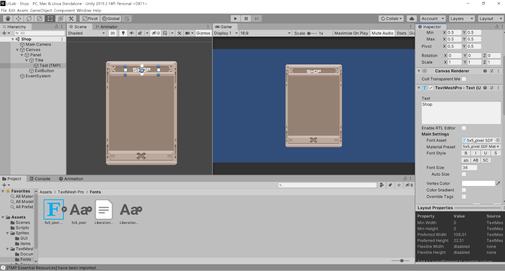  

If you select the text, you should see it in the scene. You can change the text in the TextMeshPro component in the inspector. Remember to anchor your text as well to the center of the component through the RectTransform. TextMeshPro has many options for the font type, size, alignment, etc. Here, I’ve changed the font and set the alignment to center.

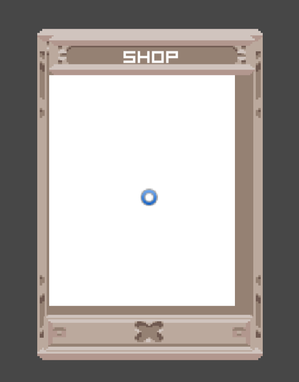

Now let’s start setting up the items to be sold in the shop. Make a new Image element as a child of the panel and name it Spacer. Go to the RectTransform to anchor it to the center of the panel holding down Shift and Alt to also change the pivot and position, and also click on the bottom right square. This will cause the image to stretch over your entire panel. Now drag the corners to resize the image so that it only covers the section of the panel where you want to display the items of the shop. Be sure to leave some room on the right for the scroll bar.

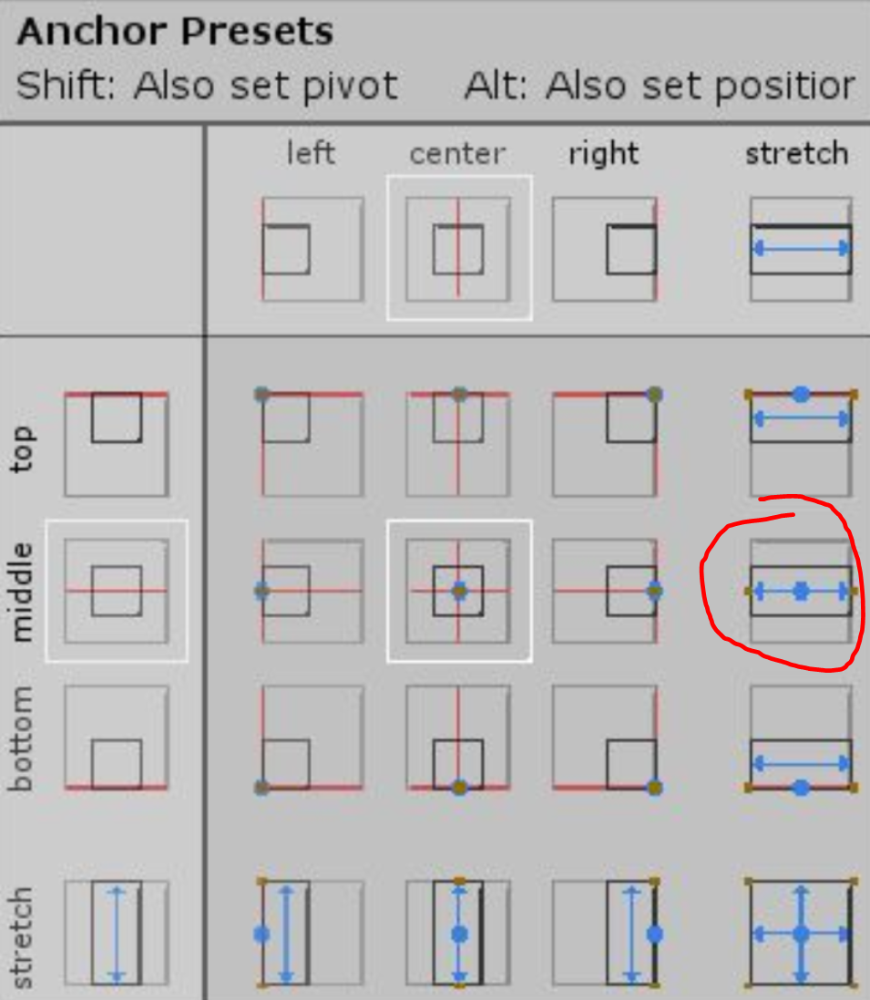

Now make another Image that is a child of Spacer. Name this Grid. This is the grid of all items that are going to be sold. Use RectTransform on this image as well, holding down Shift and Alt and clicking on the rightmost option. This will stretch the element width-wise to fill its parent.
Now add two components to Grid in the inspector: a Content Size Fitter and a Vertical Layout Group. Both components are used to allow the grid of items to grow as you add more elements into it. Content Size Fitter will change the size of the grid as you add things, and Vertical Layout Group will help you order things as you add more elements into the grid.

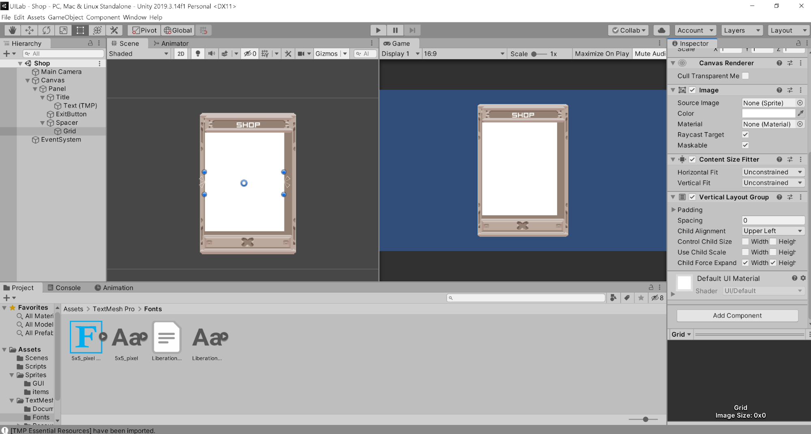  

You don’t have to change anything in Vertical Layout Group, but in Content size Fitter, change the Vertical Fit to be Preferred Size instead of Unconstrained. This will cause the height of the image to be 0 for now, but as you add things to the grid, it will also grow in size.

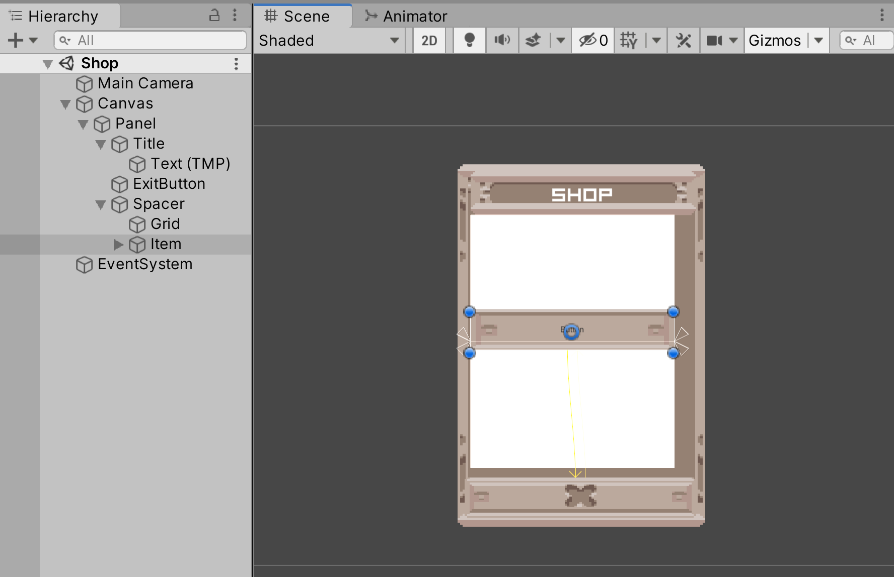

Now in Spacer, add a Button and name it Item. Make sure you’re creating this element as a child of Spacer, not Grid. This button will be how the player can buy an item, and should show multiple things: a picture of the item, the name of the item, and the price/whether you have bought the item or not. We will make a Prefab out of this, so that we can Instantiate as many items as we need.

First, let’s format the button. Use the RectTransform to stretch the button width-wise (rightmost option while holding Shift and Alt). Add the *small button* sprite to the Image component of the button, and change the height so that it can hold all the information we want.

Now let’s add the component that will allow us to put the buttons in a nice layout. Add a Layout Element component to your item and check Preferred Height and Flexible Width. Preferred Height will cause the default height of each button to be the one we set here, and the Flexible Width will cause the width of the button to correspond to the grid. Remember the Vertical Layout Group component we added to the grid? This component will work with that one, allowing the grid to grow and shrink in relationship to how many items/elements are in it.

Now, make Item a child of Grid. You shouldn’t be able to see the button any more. This is because the width of the button is 0. Click on Item and set the width to be greater than 0, which you can do via the RectTransform component, and then drag it to the width of the Spacer box.

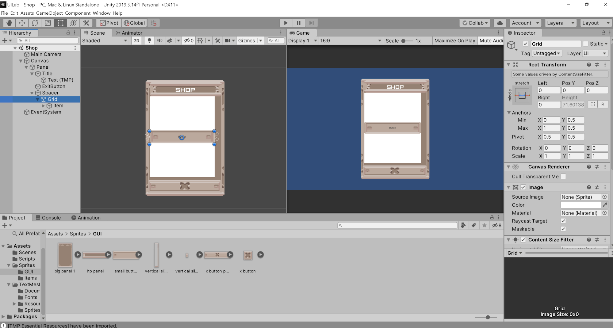  

Now let’s anchor the Grid to the top left of Spacer. Hold Shift and Alt on the RectTransform options to do this.

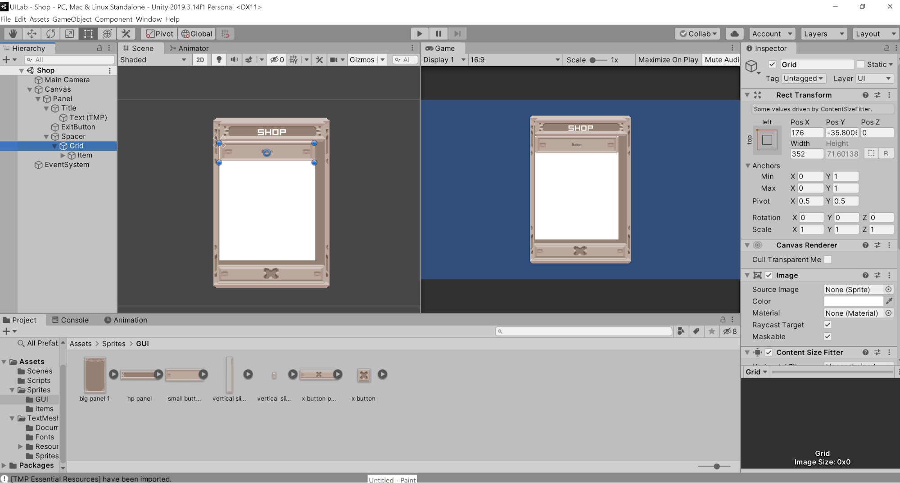  

You can check if you did this correctly by selecting Item and copy and pasting it multiple times. As you paste, it should add more buttons below the last one.

  

Keep all of the extra items; we’re going to add a scrollbar for them now. Create a new UI element called Scrollbar as a child of your panel. Under the Scrollbar component, set the Direction to Bottom to Top.

  

Anchor the Scrollbar to the right of the items and resize it however you want. Set the Image of the scrollbar to the *vertical slider panel*. Set the Image of the handle, which is a grandchild of the scrollbar, to vertical slider. Change the size of these elements to your discretion.

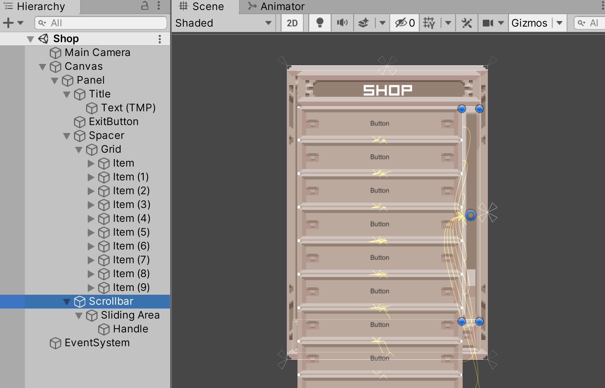  

Now let’s make the scrollbar work with our grid. Select Spacer in the hierarchy and add a ScrollRect component. Uncheck the Horizontal option, since our items will only be shifting vertically. Finally, let’s attach the scrollbar to the ScrollRect. Drag the Grid into the Content of the ScrollRect, since the grid is what we want to shift as we scroll. Then set the Vertical Scrollbar of the ScrollRect to be the scrollbar we just created.

  

Now if you hit Play, you should be able to drag the scrollbar up and down to view all the items. However, if you try using a mouse scroll wheel, you’ll notice that it’s a bit stiff. To fix this, look under the ScrollRect component in Spacer and increase the Scroll Sensitivity. I found that 10 was a good number for me. Play around until you’re happy with the results.

Great! Now we have the scroll working. However, you’ll notice that items are overflowing out of the grid, which we don’t want. To fix this, we are going to use a mask, which will hide the items that cover the background panel. Go to the Spacer in your hierarchy and add a component called Mask to it. This will cause all of the object’s children to only appear visible if they are within the space of the parent, thus masking everything outside.

  

Nice! We have the entire scroll system set up. Now that we have the scrollbar implemented, let’s work on the items. Delete every item button except for the first one. Delete its child default Text object and replace it with two TextMeshPro objects. Also add an Image to the item (as a child). This will be the sprite of the item. Anchor and position the Text and Image objects like so:

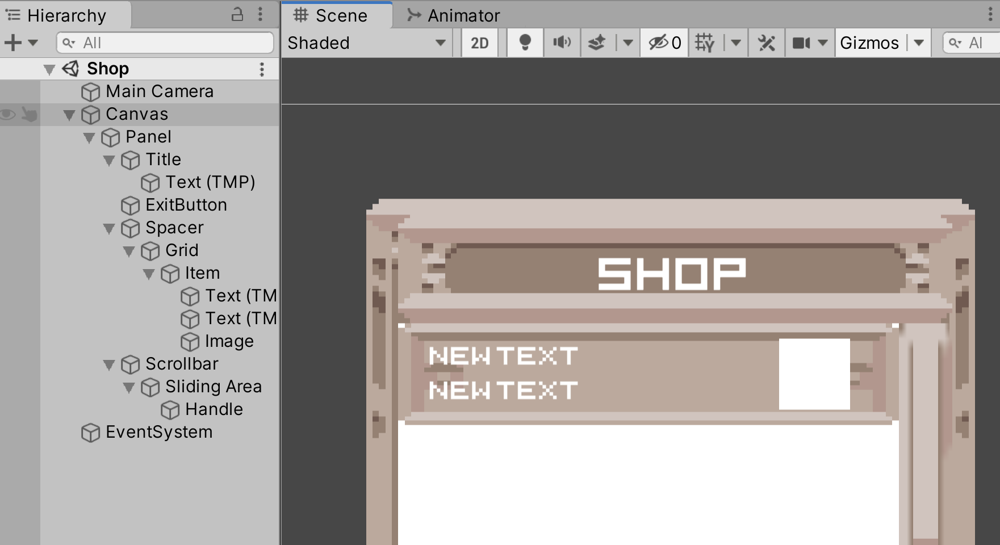

Now let’s make this into a Prefab. Create a Prefabs folder inside your Assets folder and drag the Item button into it. Once done, you should see a blue cube. Now every time we want to make a new Item slot, we can just drag out an instance of the prefab.

Now let’s make text to show how much money the player has left. Create a new TextMeshPro element as a child of the panel, and name it Money. As usual, anchor it to the correct position, and adjust the TextMeshPro settings as you see fit.
   
Finally, let’s add some functionality to our buttons! If you select your Item, you will see a component called Button. The important thing here is the **OnClick()** list in this component. This will dictate what happens when the button is pressed. To add something to the list, click on the plus sign in the corner. The field on the bottom left is where you can put a GameObject. After you place a GameObject in the field, the dropdown menu on the right will become active and you can select the button’s functionality from this list.

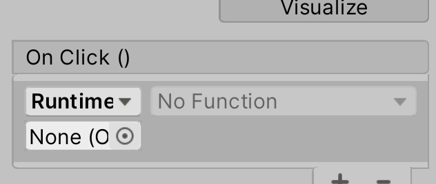  

Alright, let’s start adding the scripts! Create a new GameObject in the scene, independent of all our UI elements. Name this GameObject *GameManager*, and attach the GameManager script onto it. This will handle the currency system. Take the Money Text GameObject you just created and drag it to the Money parameter in the GameManager component. Also set your money to some number. I’m setting it as 1000.

 

Now go to the Panel GameObject and add the script ItemShop to it. In that script component, there should be an expandable field called Item List. Set the size to 5. Once you do, you should see a list of empty elements. For each one, set the item ID’s from 1 to 5 (don’t index from 0), add the necessary sprites from the Sprites folder, and set the item names and prices.

Now go to your Item GameObject. Add the script ItemHolder to it, and drag the corresponding UI elements for each item into the fields. The top text should be the item name, and the bottom text should be the item price.

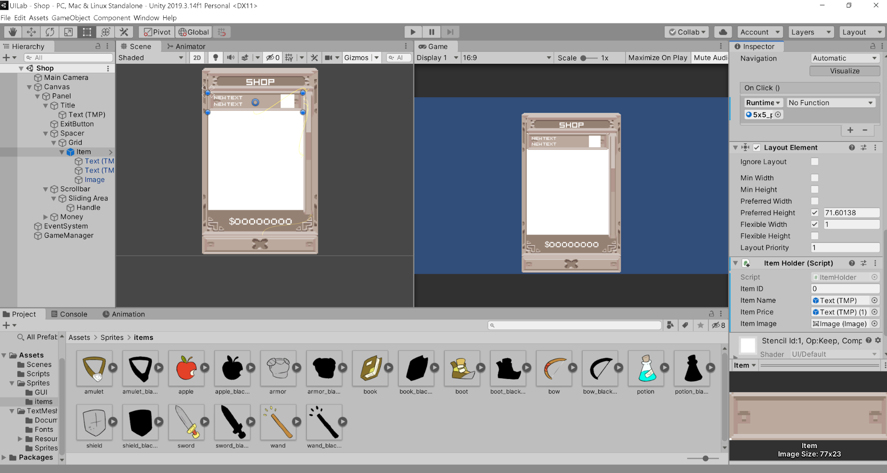

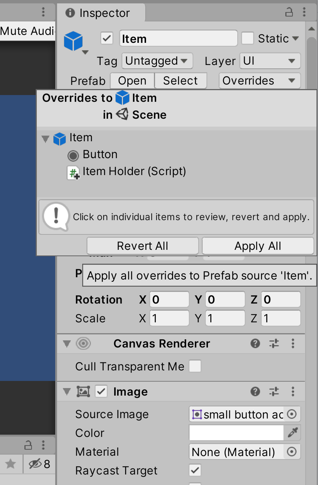

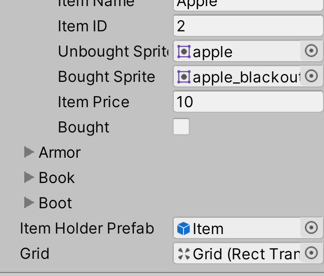

Once you’re done, don’t forget to apply these changes to your prefab so that all instances of this object will have the same changes. 

Then select the panel in the hierarchy and add the Item prefab to the Item Holder Prefab section of the Item Shop Script. It’s important that you add the Prefab to the field, instead of the GameObject in the scene. In the Grid section, add the Grid GameObject.
   
Now let’s make the buttons actually do something. In the item in the hierarchy, add the script BuyButton. In the Button component of your item, add a new condition to the OnClick() list. Drag the item itself into the GameObject slot, and in the dropdown menu, select BuyButton.BuyItem().

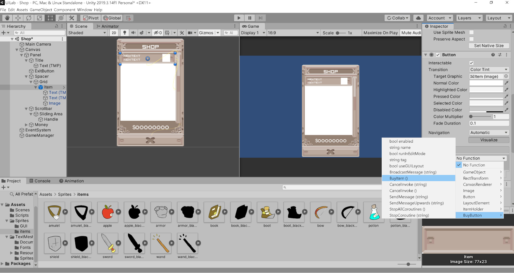  

Then make sure to apply the prefab changes again. Now you can delete this GameObject from the scene. If you play the game, you should be able to click on each item and buy it.

If you ran into any issues, make sure that your Item prefab changes have all been applied, and make sure that the Item Shop script in the panel object is holding the updated prefab in Item Holder Prefab.

### Script Rundown

Since this isn’t a scripting lab, I’ll give a quick rundown of what each script does.
**GameManager.cs**
Handles the money system. It keeps track of how much money the player has left and updates it accordingly.

**Item.cs**
Holds all the important information of each item, such as the sprite, name, and ID.

**ItemHolder.cs**
Holds the information of the UI elements of the item. This allows other scripts to change the text of the TextMeshPro and Image components of the item.

**ItemShop.cs**
Sets up the shop, Instantiating prefabs for each item and setting their data.

**BuyButton.cs**
Checks to see if the item can be bought, and updates the item and the player’s money accordingly. This is the script used by the button.

## Messing with Layering

One problem many people have when dealing with Canvas UI elements is layering. Sometimes you want an object to appear
above another, or you have a button that you can't seem to click. These issues are usually due to improper layering. For a quick
exercise in understanding UI layering, navigate to the "Layering" Scene under the Scenes folder.

In the scene hierarchy, notice that Canvas_1 has 4 child elements: Blue Background, Green
Square, Red Square, and Yellow Button. This is the same order in which they are rendered
in the scene. Try switching the order of the Green and Red Square and observe what
happens. The ordering changed!
When it comes to UI elements in a canvas, the order of the elements is determined by the
Hierarchy order. Changing the z position of a UI element will have no effect on the ordering.

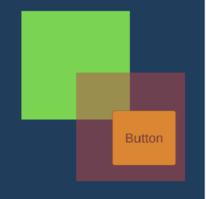

Select the Red Square and change its alpha value to 125 in the Inspector. Enter play
mode and click the Yellow Button. It should display the number of clicks in the console.
While still in play mode, move the button above the Red Square in the Hierarchy and
try clicking now. Nothing happens because the button is now being blocked.

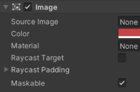

Now try un-checking Raycast Target in the Red Square's Image component. You
should now be able to click the button, but why?
The way clicks work in Unity is that a ray is cast from your monitor to the scene.

This ray then returns the UI element that it first comes in contact with. Un-
checking Raycast Target tells Unity to ignore this object when registering clicks.

## Overriding Layering with Multiple Canvases

Exit out of play mode and set "Canvas_2" in the Hierarchy to active. You should see that its being blocked by Canvas_1. In
the Inspector for Canvas_2, look at its Canvas component and set its Sort Order to 1. What happens?

Sort order determines the order in which canvases are drawn in Unity. Having a higher sort order allows a canvas to be
rendered after others, causing it to appear on top.
In rare cases, we want to be able to change the ordering of UI elements, without changing their order in the canvas hierarchy.
Though this is not recommended, we can accomplish this by adding a Canvas component to a UI element.
Set Canvas_2 to inactive to make it disappear and then select the Green Square from Canvas_1 in the Hierarchy. Scroll down in
the Inspector and click Add Component -> Canvas. Then check Override Sorting and set the Sort Order to 2. The Green Square
should now render over the Red Square and Yellow Button, despite its ordering in the Hierarchy.
By setting Canvas_2 active again, you will now see the Green Square render above it as well. This is because the Green Square is
now considered its own separate canvas and has a higher sort order than Canvas_2.

## Lab Summary

UI is present in almost every game, so I hope you learned something useful to use in your next project! If nothing else, the most important thing to take from this lab is how to anchor your RectTransforms, and to set your Canvas to Scale with Screen Size. This way, you can avoid messy UI issues when the player’s screen resolution is different from yours.

This lab doesn’t cover everything; there are a lot of UI elements that Unity provides, such as dropdown menus, scrollview, and toggles. If you’re interesting in learning more, a great place for UI resources is here: 
<a href="https://unity3d.com/learn/tutorials/topics/user-interface-ui" target="_blank">https://unity3d.com/learn/tutorials/topics/user-interface-ui</a>

It covers most of the different UI elements in more depth, and explains RectTransform in detail as well.

## Checkoff

Show your shop to a facilitator to get checked off! Make sure that you can scroll through the item list, and buy items by clicking on them.

## Challenges (Optional)

Try adding more on top of what is given. Maybe allow items to “stack” so that their sprite is only blacked out when all of the stock is sold out. Try letting the player sell things back to the shop. Be creative!

You can also redesign the shop, and set up a new layout for it.

## Bug Reports
If you experience any bugs or typos within the lab itself, please report it [here!]

[here!]: https://forms.gle/oiyM6iu3MinHfmNc7 