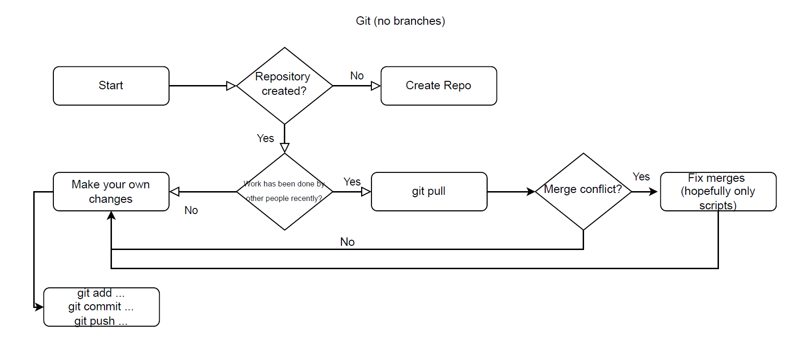
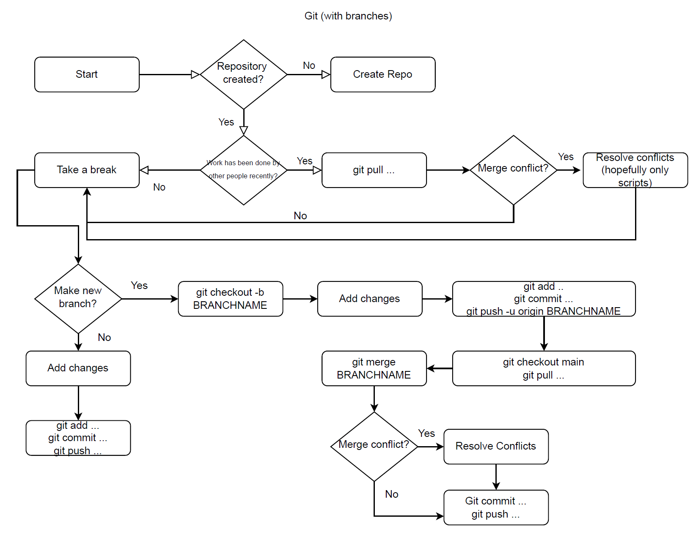

# Git and Unity Guide
{: .no_toc }

## Table of contents
{: .no_toc .text-delta }

1. TOC
{:toc}

## Preface
In this class we use Git for version control and collaboration. Why? Well imagine having to send a copy of your Unity project on a flash drive to your teammates every time you make a change. Sounds tedious right? Git streamlines this process, allowing you to not only work with others at the same time, but also save copies of your project on the cloud in case you screw something up (it’s bound to happen eventually).

However, the process of collaborating in Unity through Git is not the smoothest. You may encounter merge conflicts, you might lose your progress, your teammate Steve may even delete the files you were editing without asking you first (I still haven’t forgiven you Steve). Which is why setting up your GitHub repository correctly is an essential part of mitigating these problems in the future.

**Note**: This guide will assume you already have some base knowledge on both GitHub and Unity.

## Creating a GitHub Repository
1. Navigate to [GitHub](https://GitHub.com/).

2. Sign in to your GitHub account.

3. Click the green `New` button on the top left to create a new repository.
    * (If you don’t see this option, you can also click on your profile icon on the top right and navigate to `Your repositories`. There will be an option to create a new repository there as well.)

4. Name your repository and set your repo’s visibility to private.

5. Under `Add .gitignore`, click the drop down and search for Unity.
    * Note: If your project was downloaded from another repo, i.e. Project 1, you should skip this step because the project already has a .gitignore file.

    When finished your screen should look like this:

6. Finally, scroll down to the bottom and click `Create repository`

7. Your respository should now look like the following:

## Editing Git Ignore (Optional)
Your git ignore file will automatically be configured to ignore non-essential Unity files. However, it may be worthwhile to edit this file to include other directories that are commonly pushed to this repository by accident.

1. Click on your git ignore file in your repository.

2. Click the edit button on the top right.

3. Add these two lines anywhere on the file.
    ```
    .vscode/ # For users who use vscode
    .DS_Store # Mac OS file 
    ```

4. After adding these lines, click commit changes on the top right.

    Your git ignore file is now updated!

## Linking Your Unity Project to GitHub
**Note**: This section requires you to have [Git](https://git-scm.com/downloads) installed on your computer.

Open up a terminal and navigate to the location of your Unity project

Now run the following commands:

1. `git init --initial-branch=main`
    * **Note**: if this command didn’t work you could also do:
        * `git init`
        * `git checkout -b main`

2. `git remote add origin https://GitHub.com/USER/PROJECT-NAME.git`
    * USER is your GitHub username
    * PROJECT-NAME is the name of your GitHub Respository

3. `git pull origin main`

4. `git add .`

5. `git commit -m "YOUR COMMIT MESSAGE"`

6. `git push origin main`

If all went well, your repository on GitHub should look like the following:

For GitHub, you only need to upload the **Assets, Packages, and Project Settings** folders. Everything else is auto-generated when you/others open the project in Unity.

If you end up with any extra files, you can remove them by running the following commands in your terminal: `git rm --cached FILE_NAME`. Then commit and push this removal using the same commands above. You may also want to edit your .gitignore file to ignore these files in the future.

## Adding Collaborators
1. From your repository page, navigate to `Settings`.

2. On the left panel, click on `Collaborators`.

3. Click on `Add people` and enter the usernames or emails of your collaborators.

## Setting Up For Collaborators
1. Accept the GitHub invitation link from your email inbox.

2. Navigate to the project repository and click code.

3. Copy the .git URL under the HTTPS tab.

4. Open a terminal and navigate to the directory where you want to clone the project to.

5. Run `git clone YOUR-GIT-URL`

6. `cd` into your cloned repo directory.

Your project has now been cloned and you can add/commit/push your changes.

## Collaboration Guide
Anytime you collaborate on a GitHub repository, using branches is a great way to prevent problems from occurring. When working with other developers in Unity, this is no exception. Here are two diagrams that demonstrate the general workflow you should go through whether your group is using branches or not.

### Collaborating With No Branches


### Collaborating With Branches


### Example with Branches

**Scenario: Programmer A wants to add a new enemy type to the game**
Here’s what Programmer A should do:
1. `git pull origin main` // Get the latest changes from the main branch

2. `git checkout -b enemy-type` // Creates a new branch called “enemy-type”

3. Create the new enemy in Unity.

4. `git add… git commit… git push -u origin enemy-type` // Push local branch to git

5. `git checkout main` // Switch back to the main branch

6. `git pull origin main` // Pull any changes from main

From here you actually have two choices on how you can merge your changes on to the main branch. We will be covering both methods, as well as weighing the pros & cons of each.

**Merge Method #1: Creating a Pull Request**

This method involves creating a pull request on GitHub, a standard practice in the industry. Creating pull requests helps to notify others about your changes, let them review your changes, as well as visualize any merge conflicts your changes may have. Downsides to this method is that it requires more effort on your part, and Unity files are not easily reviewable on GitHub due to their complexity (Scenes especially).

Continuing from step 6 from the example...

1. `git checkout enemy-type` // Checkout out your branch again

2. `git merge main` // Merge main onto your branch

3. Resolve any merge conflicts. // Still may happen

4. Commit and push to remote repository.

5. Navigate to Github and make a pull request.

6. Merge your changes onto main on your pull request page.

12. Delete your old branch.

**Merge Method #2: Merging your branch directly onto main**

This method involves merging your branch changes on to main directly from the command line. A pro of this method is that it's a lot faster, especially for the purposes of this class. The downside is that if you haven't been committing your changes regularly, or haven't been updating your teammates about the files you've been editing, you could potentially lose both yours and their work. So be careful!

Continuing from step 6 from the example...

1. `git merge enemy-type` // Merge **your** branch on to main

2. Resolve any merge conflicts. // Still may happen

4. Commit and push to remote repository.

5. Delete your old branch.


## Useful Debugging for Common Git Errors
If you after you run `git pull` you get a merge conflict with your .gitignore (or any file) run  
`git checkout --ours .gitignore` or `git checkout --theirs .gitignore`
* Source: [How to tell git to accept all current changes](https://stackoverflow.com/questions/58378352/how-to-tell-git-to-accept-all-current-changes)

To connect your local main branch to the remote main branch run:
`git branch --set-upstream-to=origin/main main`

If you pull from main and get an error about unrelated histories run:
`git pull origin main --allow-unrelated-histories`
* Source: [Allowing unrelated histories on rebase](https://stackoverflow.com/questions/37937984/git-refusing-to-merge-unrelated-histories-on-rebase)

If you accidentally push files you don’t need to the GitHub repo run:
1. `git rm --cached FILE_NAME`

2. `git commit -m "YOUR MESSAGE"`

3. `git push`


